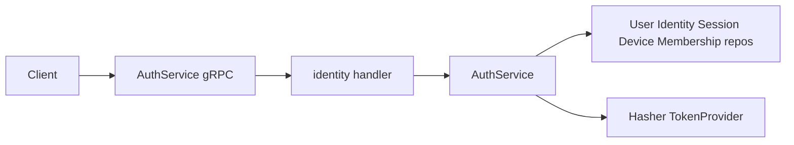
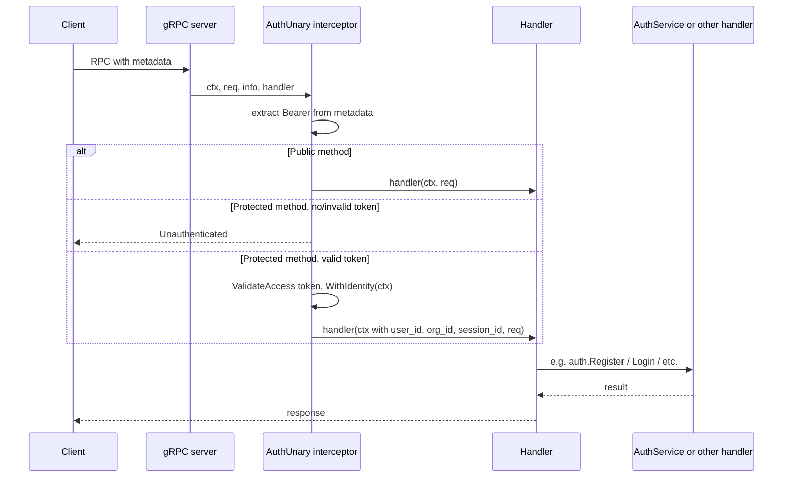

# Auth Implementation

This document describes the authentication implementation for the zero-trust control plane backend: architecture, API surface, security measures, flows, and configuration. The canonical proto is [internal/proto/auth/auth.proto](../proto/auth/auth.proto); business logic lives in [internal/identity/service/auth_service.go](../internal/identity/service/auth_service.go); the gRPC server is implemented in [internal/identity/handler/grpc.go](../internal/identity/handler/grpc.go).

**Audience**: Developers integrating with or extending the auth system (clients, tests, or backend changes).

## Overview

Auth provides **password-only** authentication for Browser, CLI, and Admin UI with enterprise-grade security: bcrypt password hashing, JWT access and refresh tokens (RS256/ES256), refresh-token rotation, session binding via `refresh_jti` and hashed refresh token, refresh reuse detection (revoke all user sessions on reuse), and strong password policy (12+ chars, mixed case, number, symbol).

**Scope**: Register, Login, Refresh, and Logout are implemented. **LinkIdentity** is reserved for future OIDC/SAML and currently returns Unimplemented.

### When auth is enabled

Auth is enabled when `DATABASE_URL` and **both** `JWT_PRIVATE_KEY` and `JWT_PUBLIC_KEY` are set. See [cmd/server/main.go](../cmd/server/main.go) line 43: `authEnabled := cfg.DatabaseURL != "" && cfg.JWTPrivateKey != "" && cfg.JWTPublicKey != ""`. When enabled, the server opens the database, builds the auth service and repos, registers the auth interceptor, and auth RPCs are fully functional.

### When auth is disabled

If any of the three (DATABASE_URL, JWT_PRIVATE_KEY, JWT_PUBLIC_KEY) is missing: no database connection is opened, no auth service is created, no auth interceptor is registered, and auth RPCs (Register, Login, Refresh, Logout, LinkIdentity) return **Unimplemented**. All other gRPC methods remain callable without a Bearer token.

---

## Architecture

**Layers**: gRPC AuthService (proto) → identity handler (proto ↔ domain) → auth service (business logic) → repos (user, identity, session, device, membership) and security (hasher, token provider).

### Wiring (startup)

When `authEnabled` is true, [cmd/server/main.go](../cmd/server/main.go) does the following:

1. Opens the database with `db.Open(cfg.DatabaseURL)`.
2. Creates the hasher with `security.NewHasher(cfg.BcryptCost)`.
3. Parses JWT keys via [internal/security/keys.go](../internal/security/keys.go) `ParsePrivateKey` and `ParsePublicKey` (supports inline PEM or file path; see `LoadPEM`).
4. Builds `TokenProvider` with issuer, audience, and TTLs from config.
5. Creates the five repos (user, identity, session, device, membership) and `NewAuthService(...)`, then sets `deps.Auth`.
6. Builds `publicMethods` with the four full method names: AuthService Register, Login, Refresh; HealthService HealthCheck.
7. Creates the gRPC server with `grpc.NewServer(grpc.UnaryInterceptor(interceptors.AuthUnary(tokens, publicMethods)))`.

[internal/server/grpc.go](../internal/server/grpc.go) `RegisterServices` passes `deps.Auth` into `identityhandler.NewAuthServer(authSvc)`. If `deps.Auth == nil` (auth disabled), the handler returns Unimplemented for all auth RPCs.

### Component diagram

### Request path (protected RPC)

For a protected RPC, the request passes through the auth interceptor before the handler. Public methods (Register, Login, Refresh, HealthCheck) skip Bearer validation and proceed even with no or invalid token.

---

## API Surface

### RPCs

| RPC | Request | Response | AuthResponse contents | Notes |
|-----|--------|----------|------------------------|-------|
| Register | RegisterRequest | AuthResponse | `user_id` only | No tokens or org_id until Login with org. |
| Login | LoginRequest | AuthResponse | access_token, refresh_token, expires_at, user_id, org_id | Full session. |
| Refresh | RefreshRequest | AuthResponse | Same as Login | New tokens (rotation). |
| Logout | LogoutRequest | google.protobuf.Empty | — | Revokes session by refresh_token or by Bearer context. |
| LinkIdentity | LinkIdentityRequest | LinkIdentityResponse | — | Stub; returns Unimplemented. |

### Public methods (no Bearer required)

The following full method names are treated as public; they do not require a valid Bearer token. Any other method requires a valid Bearer (access) token.

- `AuthService_Register_FullMethodName`
- `AuthService_Login_FullMethodName`
- `AuthService_Refresh_FullMethodName`
- `HealthService_HealthCheck_FullMethodName`

These are configured in [cmd/server/main.go](../cmd/server/main.go) in the `publicMethods` map passed to the auth interceptor.

### Messages

- **RegisterRequest**: `email`, `password`, optional `name`.
- **LoginRequest**: `email`, `password`, `org_id` (required), optional `device_fingerprint` (used to get-or-create device for the session).
- **RefreshRequest**: `refresh_token`.
- **LogoutRequest**: optional `refresh_token`; if empty, the session is revoked from context when the client sends a valid Bearer (access) token (auth interceptor sets session_id in context).
- **AuthResponse**: `access_token`, `refresh_token`, `expires_at` (Timestamp), `user_id`, `org_id`. Fields may be empty depending on RPC: Register returns only `user_id`; Login and Refresh return all fields.
- **Logout**: returns `google.protobuf.Empty`.

### Errors

The handler maps auth-service sentinel errors to gRPC status codes in [internal/identity/handler/grpc.go](../internal/identity/handler/grpc.go) `authErr()` (switch on sentinels from [auth_service.go](../internal/identity/service/auth_service.go)):

| Service error | gRPC code |
|---------------|-----------|
| ErrEmailAlreadyRegistered | AlreadyExists |
| ErrInvalidCredentials | Unauthenticated |
| ErrInvalidRefreshToken | Unauthenticated |
| ErrRefreshTokenReuse | Unauthenticated |
| ErrNotOrgMember | PermissionDenied |
| Validation (email, password, etc.) | InvalidArgument |

Login returns a generic "invalid credentials" on failure so that "user not found" and "wrong password" are indistinguishable.

---

## Security

### Passwords

- **Hashing**: [internal/security/hashing.go](../internal/security/hashing.go) uses bcrypt. Cost is configurable (default 12). Comparison is constant-time via `bcrypt.CompareHashAndPassword`. Callers must not log or persist plaintext passwords.
- **Policy**: Min 12 characters; at least one uppercase, one lowercase, one number, and one symbol (non-alphanumeric). Enforced on Register.
- **Validation**: Email and password validation live in [auth_service.go](../internal/identity/service/auth_service.go) as `validateEmail` (simple regex) and `validatePassword` (length and character classes).

### Tokens

- **Implementation**: [internal/security/tokens.go](../internal/security/tokens.go) uses **RS256/ES256** (asymmetric: `JWT_PRIVATE_KEY` + `JWT_PUBLIC_KEY`). The algorithm is chosen from the key type in `sign()`: RSA public key → RS256, ECDSA public key → ES256. Issuer (`iss`) and audience (`aud`) are set on all tokens and validated on refresh.
- **Key loading**: Keys can be inline PEM (string starting with `-----BEGIN`) or a file path; [internal/security/keys.go](../internal/security/keys.go) `LoadPEM` treats a value that looks like PEM as inline, otherwise reads from the filesystem.
- **Access token**: Short-lived. Claims: `jti`, `sub` (user_id), `org_id`, `session_id`, `iss`, `aud`, `exp`, `iat`.
- **Refresh token**: Long-lived. Claims: `session_id`, `jti` (unique id for rotation), `sub`, `org_id`, `iss`, `aud`, `exp`, `iat`.

### Refresh token hash

The current refresh token is hashed (SHA-256, hex) and stored in **sessions.refresh_token_hash**. [internal/security/refresh_hash.go](../internal/security/refresh_hash.go) provides `HashRefreshToken(token)` and `RefreshTokenHashEqual(providedToken, storedHash)`; the comparison is constant-time. If the DB leaks, attackers cannot use refresh tokens without the actual token string. Migration [internal/db/migrations/004_refresh_token_hash.up.sql](../internal/db/migrations/004_refresh_token_hash.up.sql) adds the column. Legacy sessions (empty hash) allow jti-only check until next rotation.

### Refresh rotation and reuse detection

On **Refresh**, the service validates the refresh JWT (signature, exp, iss, aud), loads the session by `session_id`, and verifies the session is not revoked. If `session.refresh_jti != token jti` (old token reused after rotation), the service **revokes all sessions for that user** and returns `ErrRefreshTokenReuse` (possible compromise). Otherwise it verifies the refresh token hash (when stored), then issues new access and refresh tokens (new jti), updates `session.refresh_jti` and `session.refresh_token_hash`, and returns the new AuthResponse.

### Auth interceptor

A unary gRPC interceptor ([internal/server/interceptors/auth.go](../internal/server/interceptors/auth.go)) runs when auth is enabled.

- **Bearer extraction**: It reads the gRPC metadata key `authorization` and expects `Bearer <access_token>` (case-insensitive "bearer" prefix), per `extractBearer`. Leading/trailing space is trimmed.
- **Public methods**: If the RPC is in `publicMethods`, the request is allowed through even when the token is missing or invalid; identity is not set in context.
- **Protected methods**: If the RPC is not public and the client does not send a valid Bearer token (missing or `TokenProvider.ValidateAccess` fails), the interceptor returns `Unauthenticated` immediately and the handler is not called.
- **Valid token**: On successful `ValidateAccess`, the interceptor calls `WithIdentity(ctx, userID, orgID, sessionID)`. Handlers and the auth service read identity via [internal/server/interceptors/context.go](../internal/server/interceptors/context.go) `GetUserID`, `GetOrgID`, and `GetSessionID`. Logout with empty `refresh_token` revokes the session from context when the caller sent a valid Bearer token.

### Session binding

The **sessions** table includes nullable `refresh_jti` and `refresh_token_hash`. See [internal/db/sqlc/schema/001_schema.sql](../internal/db/sqlc/schema/001_schema.sql) and migrations 003 and 004. Apply migrations 003 and 004 when adding auth to an existing database.

### Validation

- **Register**: Email format (simple regex) and password strength (12+ chars, upper, lower, number, symbol).
- **Login**: Generic "invalid credentials" for wrong password or missing user/identity to avoid leaking account existence.

---

## Flows

### Register

1. Validate email format and password strength (via `validateEmail` and `validatePassword` in [auth_service.go](../internal/identity/service/auth_service.go)).
2. Ensure no user exists with the given email (return AlreadyExists if so).
3. Create user (status active) and local identity (provider `local`, provider_id = email, bcrypt-hashed password).
4. Return AuthResponse with `user_id` only (no tokens or org_id). **No organization or membership is created.** To obtain tokens, the user must later be added to an org (a row in **memberships**). **MembershipService.AddMember is currently unimplemented**; in practice, membership is created manually (e.g. direct DB insert or admin tool) until AddMember is implemented. After membership exists, the client calls Login with that `org_id`.

### Login

1. Validate email, password, and org_id (non-empty).
2. Get user by email; get local identity by user and provider; compare password (constant-time). Return invalid credentials on any failure.
3. Require org_id and validate membership via `GetMembershipByUserAndOrg`. If no membership, return `ErrNotOrgMember` → PermissionDenied.
4. Get or create device: if `device_fingerprint` is provided, look up by user/org/fingerprint; if not found, create. If not provided, use fingerprint `"password-login"` and create device if needed ([auth_service.go](../internal/identity/service/auth_service.go)).
5. Create session with id, user_id, org_id, device_id, expires_at, and **refresh_jti** and **refresh_token_hash** from the first refresh token (`security.HashRefreshToken(refreshToken)`). Session is created after issuing the first refresh token so the hash can be stored.
6. Issue access and refresh JWTs; return AuthResponse with tokens, expires_at, user_id, org_id.

### Refresh

1. **JWT validation first** (no DB): validate refresh JWT (signature, exp, iss, aud) and parse session_id and jti.
2. Load session; if not found or revoked, return ErrInvalidRefreshToken. **Reuse check**: if `session.refresh_jti != jti` (old token reused after rotation), revoke all sessions for that user and return ErrRefreshTokenReuse.
3. If session has refresh_token_hash, require `RefreshTokenHashEqual(provided token, session.refresh_token_hash)`; else allow (legacy).
4. Update session last_seen; issue new access and refresh tokens (new jti); update session via `UpdateRefreshToken(sessionID, newJti, Hash(newRefresh))`.
5. Return AuthResponse with new tokens and same user_id, org_id.

### Logout

Two paths:

1. **refresh_token provided**: Validate refresh JWT and parse session_id; revoke that session (set revoked_at). If validation fails, the handler returns success anyway (no error to caller).
2. **refresh_token empty**: If the auth interceptor set session_id in context (client sent a valid Bearer access token), revoke that session via `interceptors.GetSessionID(ctx)`; otherwise no-op.

In both cases the RPC returns Empty.

---

## Configuration

Auth is enabled when `DATABASE_URL` and **both** `JWT_PRIVATE_KEY` and `JWT_PUBLIC_KEY` are set. The following env vars are used:

| Variable | Description | Default |
|----------|-------------|---------|
| GRPC_ADDR | Address the gRPC server listens on (e.g. `:8080`). | `:8080` |
| DATABASE_URL | Postgres DSN; **required** when auth is enabled. | (none) |
| JWT_PRIVATE_KEY | PEM-encoded private key (RSA or ECDSA) or path to file; **required** when auth is enabled. | (none) |
| JWT_PUBLIC_KEY | PEM-encoded public key or path to file; **required** when auth is enabled. | (none) |
| JWT_ISSUER | Issuer claim (e.g. `ztcp-auth`). | `ztcp-auth` |
| JWT_AUDIENCE | Audience claim (e.g. `ztcp-api`). | `ztcp-api` |
| JWT_ACCESS_TTL | Access token lifetime (e.g. `15m`). | `15m` |
| JWT_REFRESH_TTL | Refresh token lifetime (e.g. `168h` for 7 days). | `168h` |
| BCRYPT_COST | Bcrypt cost factor (4–31). | `12` |

**JWT keys**: Values can be either inline PEM (string starting with `-----BEGIN`) or a file path; [internal/security/keys.go](../internal/security/keys.go) `LoadPEM` treats a value that looks like PEM as inline, otherwise reads from the filesystem.

**AccessTTL / RefreshTTL**: Parsed in [internal/config/config.go](../internal/config/config.go) via `AccessTTL()` and `RefreshTTL()` (Go `time.ParseDuration`). If unset or invalid, they fall back to 15 minutes and 168 hours (7 days) respectively.

Config is loaded in [internal/config/config.go](../internal/config/config.go) (Viper: optional `.env` file, then env). See [.env.example](../.env.example) for a template. For production, load the private key from KMS/Vault (e.g. env populated by sidecar or startup script).

---

## Database and Schema

Auth uses the **users**, **identities**, **memberships**, **devices**, and **sessions** tables. Full schema and table definitions are in [database.md](database.md). Apply migrations 003 and 004 when adding auth to an existing database so that `sessions.refresh_jti` and `sessions.refresh_token_hash` exist.

### Table roles (auth)

| Table | Role in auth |
|-------|----------------|
| **users** | id, email, name, status; created by Register; looked up by email on Login. |
| **identities** | user_id, provider (`local`), provider_id (email), password_hash; local identity created by Register; Login uses GetByUserAndProvider and compares password. |
| **memberships** | user_id, org_id, role; required for Login (GetMembershipByUserAndOrg); no membership → PermissionDenied. |
| **devices** | user_id, org_id, fingerprint; get-or-create per Login (default fingerprint `"password-login"` if not provided). |
| **sessions** | user_id, org_id, device_id, expires_at, revoked_at, last_seen_at, **refresh_jti**, **refresh_token_hash**; created on Login; refreshed via UpdateRefreshToken; revoked on Logout or reuse. |

---

## Testing

Unit tests cover:

- **Hashing**: [internal/security/hashing_test.go](../internal/security/hashing_test.go) — Hash/Compare, wrong password, cost.
- **Tokens**: [internal/security/tokens_test.go](../internal/security/tokens_test.go) — IssueAccess, IssueRefresh, ValidateRefresh, ValidateAccess, invalid token.
- **Auth service**: [internal/identity/service/auth_service_test.go](../internal/identity/service/auth_service_test.go) — Register (success and duplicate email), validation failures, Login requires membership, Login/Refresh/Logout flow, Logout from context (session_id in context), wrong password. Uses in-memory stub repos. Auth RPCs (Register, Login, Refresh) are public, so tests can call them without a Bearer token.

---

## Future

- **LinkIdentity**: Implement for OIDC/SAML; link external identity to user and store provider_id/id_token or assertion.
- **MembershipService.AddMember**: Implementing AddMember (and related membership RPCs) would provide an in-app way to add a registered user to an organization, instead of creating memberships manually (e.g. direct DB or admin tool).
