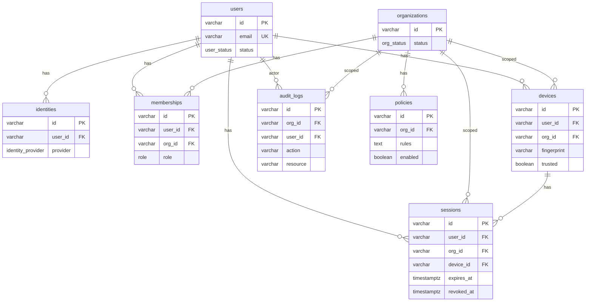

# Database Structure

This document describes the current PostgreSQL schema for the zero-trust control plane backend. The canonical schema is maintained in [internal/db/sqlc/schema/001_schema.sql](../internal/db/sqlc/schema/001_schema.sql) and applied via [internal/db/migrations/](../internal/db/migrations/).

**Audience**: Developers working on schema, migrations, repos, or features that persist data.

## Overview

The schema is organized around **users**, **organizations** (tenants), and **identity**. Users belong to organizations through **memberships**; they authenticate via **identities** (local, OIDC, or SAML). **Devices** and **sessions** are scoped to a user and org. **Policies** are org-scoped. **Audit logs** record org-level activity.

All timestamps use `TIMESTAMPTZ`. Primary keys for core entities are `VARCHAR` (e.g. UUIDs).

### When the database is used

The database is opened only when auth is enabled: `DATABASE_URL` and both `JWT_PRIVATE_KEY` and `JWT_PUBLIC_KEY` must be set ([cmd/server/main.go](../cmd/server/main.go)). When auth is disabled, no database connection is opened; all persistence (auth, memberships, etc.) is unavailable and auth RPCs return Unimplemented. The connection is opened via [internal/db/postgres.go](../internal/db/postgres.go) `Open(dsn)` (pgx driver; caller must call `Close`).

---

## Enums

| Enum | Values | Use |
|------|--------|-----|
| `user_status` | `active`, `disabled` | User account state |
| `identity_provider` | `local`, `oidc`, `saml` | Auth provider for an identity |
| `org_status` | `active`, `suspended` | Organization state |
| `role` | `owner`, `admin`, `member` | User role within an organization |

---

## Tables

### users

Core user account. No foreign keys; referenced by identities, memberships, devices, sessions, and audit logs.

| Column | Type | Constraints |
|--------|------|-------------|
| `id` | VARCHAR | PRIMARY KEY |
| `email` | VARCHAR | NOT NULL, UNIQUE |
| `name` | VARCHAR | nullable |
| `status` | user_status | NOT NULL |
| `created_at` | TIMESTAMPTZ | NOT NULL |
| `updated_at` | TIMESTAMPTZ | NOT NULL |

---

### identities

Links a user to an authentication provider (local password, OIDC, or SAML). One user can have multiple identities (e.g. email/password and Google).

| Column | Type | Constraints |
|--------|------|-------------|
| `id` | VARCHAR | PRIMARY KEY |
| `user_id` | VARCHAR | NOT NULL, REFERENCES users(id) |
| `provider` | identity_provider | NOT NULL |
| `provider_id` | VARCHAR | NOT NULL |
| `password_hash` | VARCHAR | nullable (used for `local` provider) |
| `created_at` | TIMESTAMPTZ | NOT NULL |

---

### organizations

Tenant/organization. Referenced by memberships, devices, sessions, policies, and audit_logs.

| Column | Type | Constraints |
|--------|------|-------------|
| `id` | VARCHAR | PRIMARY KEY |
| `name` | VARCHAR | NOT NULL |
| `status` | org_status | NOT NULL |
| `created_at` | TIMESTAMPTZ | NOT NULL |

---

### memberships

User–organization association with a role. Determines access and permissions within an org.

| Column | Type | Constraints |
|--------|------|-------------|
| `id` | VARCHAR | PRIMARY KEY |
| `user_id` | VARCHAR | NOT NULL, REFERENCES users(id) |
| `org_id` | VARCHAR | NOT NULL, REFERENCES organizations(id) |
| `role` | role | NOT NULL |
| `created_at` | TIMESTAMPTZ | NOT NULL |

---

### devices

Device registered to a user within an org (e.g. for device trust and session binding). Identified by `fingerprint` per user/org.

| Column | Type | Constraints |
|--------|------|-------------|
| `id` | VARCHAR | PRIMARY KEY |
| `user_id` | VARCHAR | NOT NULL, REFERENCES users(id) |
| `org_id` | VARCHAR | NOT NULL, REFERENCES organizations(id) |
| `fingerprint` | VARCHAR | NOT NULL |
| `trusted` | BOOLEAN | NOT NULL |
| `last_seen_at` | TIMESTAMPTZ | nullable |
| `created_at` | TIMESTAMPTZ | NOT NULL |

---

### sessions

Active or revoked session for a user in an org on a device. The columns `refresh_jti` and `refresh_token_hash` are required for auth refresh rotation and reuse detection; for existing databases created before they existed, apply migrations 003 and 004 (see [Migrations](#migrations)).

| Column | Type | Constraints |
|--------|------|-------------|
| `id` | VARCHAR | PRIMARY KEY |
| `user_id` | VARCHAR | NOT NULL, REFERENCES users(id) |
| `org_id` | VARCHAR | NOT NULL, REFERENCES organizations(id) |
| `device_id` | VARCHAR | NOT NULL, REFERENCES devices(id) |
| `expires_at` | TIMESTAMPTZ | NOT NULL |
| `revoked_at` | TIMESTAMPTZ | nullable |
| `last_seen_at` | TIMESTAMPTZ | nullable |
| `ip_address` | VARCHAR | nullable |
| `refresh_jti` | VARCHAR | nullable; current refresh token JTI for rotation; updated on each Refresh |
| `refresh_token_hash` | VARCHAR | nullable; SHA-256 hash of current refresh token; used to validate refresh tokens without storing the token (see [auth.md](auth.md)) |
| `created_at` | TIMESTAMPTZ | NOT NULL |

---

### policies

Org-scoped policy definition. `rules` holds the policy content (e.g. JSON or text); `enabled` toggles application.

| Column | Type | Constraints |
|--------|------|-------------|
| `id` | VARCHAR | PRIMARY KEY |
| `org_id` | VARCHAR | NOT NULL, REFERENCES organizations(id) |
| `rules` | TEXT | NOT NULL |
| `enabled` | BOOLEAN | NOT NULL |
| `created_at` | TIMESTAMPTZ | NOT NULL |

---

### audit_logs

Immutable log of actions per org. `user_id` may be null for system actions.

| Column | Type | Constraints |
|--------|------|-------------|
| `id` | VARCHAR | PRIMARY KEY |
| `org_id` | VARCHAR | NOT NULL, REFERENCES organizations(id) |
| `user_id` | VARCHAR | nullable, REFERENCES users(id) |
| `action` | VARCHAR | NOT NULL |
| `resource` | VARCHAR | NOT NULL |
| `ip` | VARCHAR | NOT NULL |
| `metadata` | TEXT | nullable |
| `created_at` | TIMESTAMPTZ | NOT NULL |

---

## Entity Relationships

Session columns used for auth (e.g. `refresh_jti`, `refresh_token_hash`) are documented in the sessions table above.

---

## Migrations

Migrations are applied in order from [internal/db/migrations/](../internal/db/migrations/). Each migration has an up and a down script.

| Migration | Description |
|-----------|-------------|
| **001_schema** | Creates enums and tables: users, identities, organizations, memberships, devices, sessions, policies, audit_logs, telemetry. Baseline schema. |
| **002_drop_telemetry** | Drops the `telemetry` table if present. |
| **003_refresh_jti** | Adds `sessions.refresh_jti` (VARCHAR, nullable). For existing DBs created before this column. |
| **004_refresh_token_hash** | Adds `sessions.refresh_token_hash` (VARCHAR, nullable). For existing DBs created before this column. |

The **canonical schema** for sqlc ([internal/db/sqlc/schema/001_schema.sql](../internal/db/sqlc/schema/001_schema.sql)) is the single source of truth for codegen and already includes `refresh_jti` and `refresh_token_hash` (and does not include telemetry). Migrations 003 and 004 are for databases that were created from migration 001 before those columns were added to the canonical schema. New deployments run all ups; existing DBs may need 003 and 004 when adding auth.

---

## Schema and Codegen

### Canonical schema

[internal/db/sqlc/schema/001_schema.sql](../internal/db/sqlc/schema/001_schema.sql) is the single source for table and enum definitions used by sqlc. Do not edit generated Go in `gen/`.

### Migrations (applied to database)

Migrations are applied in order (001, 002, 003, 004). Up/down scripts live in [internal/db/migrations/](../internal/db/migrations/). After changing schema, add or update migrations (up/down) and apply them to the database.

### Connection

[internal/db/postgres.go](../internal/db/postgres.go) `Open(dsn)` opens a Postgres connection using the pgx driver. It is used in [cmd/server/main.go](../cmd/server/main.go) when auth is enabled. The caller must call `Close` when done.

### Queries and codegen

SQL queries live in [internal/db/sqlc/queries/](../internal/db/sqlc/queries/) (one file per domain: user, identity, organization, membership, device, session, policy, audit_log). [internal/db/sqlc/sqlc.yaml](../internal/db/sqlc/sqlc.yaml) configures the schema path, queries path, and Go output to `gen/`. Generated Go is in [internal/db/sqlc/gen/](../internal/db/sqlc/gen/); do not edit.

### Repositories

Domain repos (user, identity, session, device, membership, organization, policy, audit) use the generated queries and map results to domain types. See `internal/*/repository/postgres.go`. Auth uses the user, identity, session, device, and membership repos.

### Workflow

After changing schema or queries, run sqlc generate to regenerate `gen/`. After changing schema, add or update migrations (up/down) and apply them to the database.

### Cross-reference to auth

For how each table is used by the auth flows (Register, Login, Refresh, Logout), see [auth.md](auth.md) "Database and Schema" / "Table roles (auth)".

