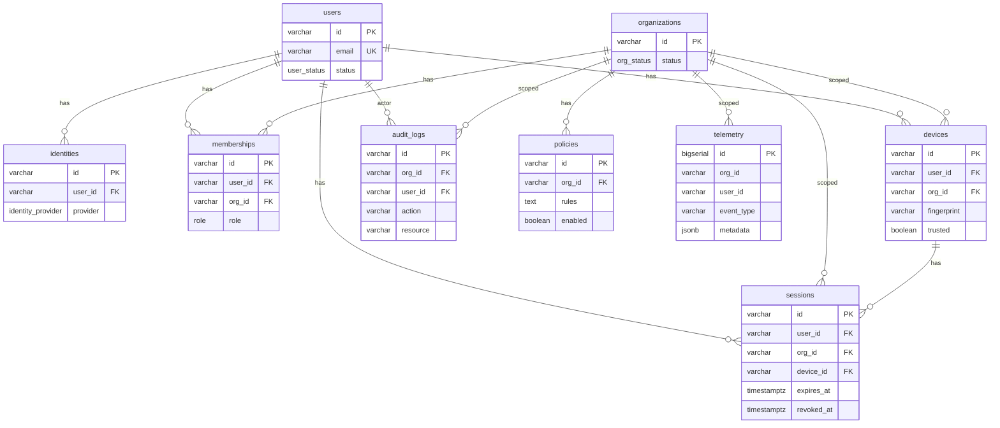

# Database Structure

This document describes the current PostgreSQL schema for the zero-trust control plane backend. The canonical schema is maintained in [internal/db/sqlc/schema/001_schema.sql](../internal/db/sqlc/schema/001_schema.sql) and applied via [internal/db/migrations/](../internal/db/migrations/).

## Overview

The schema is organized around **users**, **organizations** (tenants), and **identity**. Users belong to organizations through **memberships**; they authenticate via **identities** (local, OIDC, or SAML). **Devices** and **sessions** are scoped to a user and org. **Policies** are org-scoped. **Audit logs** and **telemetry** record org-level activity.

All timestamps use `TIMESTAMPTZ`. Primary keys for core entities are `VARCHAR` (e.g. UUIDs); **telemetry** uses `BIGSERIAL` for high-volume append-only data.

---

## Enums

| Enum | Values | Use |
|------|--------|-----|
| `user_status` | `active`, `disabled` | User account state |
| `identity_provider` | `local`, `oidc`, `saml` | Auth provider for an identity |
| `org_status` | `active`, `suspended` | Organization state |
| `role` | `owner`, `admin`, `member` | User role within an organization |

---

## Tables

### users

Core user account. No foreign keys; referenced by identities, memberships, devices, sessions, and audit logs.

| Column | Type | Constraints |
|--------|------|-------------|
| `id` | VARCHAR | PRIMARY KEY |
| `email` | VARCHAR | NOT NULL, UNIQUE |
| `name` | VARCHAR | nullable |
| `status` | user_status | NOT NULL |
| `created_at` | TIMESTAMPTZ | NOT NULL |
| `updated_at` | TIMESTAMPTZ | NOT NULL |

---

### identities

Links a user to an authentication provider (local password, OIDC, or SAML). One user can have multiple identities (e.g. email/password and Google).

| Column | Type | Constraints |
|--------|------|-------------|
| `id` | VARCHAR | PRIMARY KEY |
| `user_id` | VARCHAR | NOT NULL, REFERENCES users(id) |
| `provider` | identity_provider | NOT NULL |
| `provider_id` | VARCHAR | NOT NULL |
| `password_hash` | VARCHAR | nullable (used for `local` provider) |
| `created_at` | TIMESTAMPTZ | NOT NULL |

---

### organizations

Tenant/organization. Referenced by memberships, devices, sessions, policies, audit_logs, and telemetry.

| Column | Type | Constraints |
|--------|------|-------------|
| `id` | VARCHAR | PRIMARY KEY |
| `name` | VARCHAR | NOT NULL |
| `status` | org_status | NOT NULL |
| `created_at` | TIMESTAMPTZ | NOT NULL |

---

### memberships

User–organization association with a role. Determines access and permissions within an org.

| Column | Type | Constraints |
|--------|------|-------------|
| `id` | VARCHAR | PRIMARY KEY |
| `user_id` | VARCHAR | NOT NULL, REFERENCES users(id) |
| `org_id` | VARCHAR | NOT NULL, REFERENCES organizations(id) |
| `role` | role | NOT NULL |
| `created_at` | TIMESTAMPTZ | NOT NULL |

---

### devices

Device registered to a user within an org (e.g. for device trust and session binding). Identified by `fingerprint` per user/org.

| Column | Type | Constraints |
|--------|------|-------------|
| `id` | VARCHAR | PRIMARY KEY |
| `user_id` | VARCHAR | NOT NULL, REFERENCES users(id) |
| `org_id` | VARCHAR | NOT NULL, REFERENCES organizations(id) |
| `fingerprint` | VARCHAR | NOT NULL |
| `trusted` | BOOLEAN | NOT NULL |
| `last_seen_at` | TIMESTAMPTZ | nullable |
| `created_at` | TIMESTAMPTZ | NOT NULL |

---

### sessions

Active or revoked session for a user in an org on a device.

| Column | Type | Constraints |
|--------|------|-------------|
| `id` | VARCHAR | PRIMARY KEY |
| `user_id` | VARCHAR | NOT NULL, REFERENCES users(id) |
| `org_id` | VARCHAR | NOT NULL, REFERENCES organizations(id) |
| `device_id` | VARCHAR | NOT NULL, REFERENCES devices(id) |
| `expires_at` | TIMESTAMPTZ | NOT NULL |
| `revoked_at` | TIMESTAMPTZ | nullable |
| `last_seen_at` | TIMESTAMPTZ | nullable |
| `ip_address` | VARCHAR | nullable |
| `created_at` | TIMESTAMPTZ | NOT NULL |

---

### policies

Org-scoped policy definition. `rules` holds the policy content (e.g. JSON or text); `enabled` toggles application.

| Column | Type | Constraints |
|--------|------|-------------|
| `id` | VARCHAR | PRIMARY KEY |
| `org_id` | VARCHAR | NOT NULL, REFERENCES organizations(id) |
| `rules` | TEXT | NOT NULL |
| `enabled` | BOOLEAN | NOT NULL |
| `created_at` | TIMESTAMPTZ | NOT NULL |

---

### audit_logs

Immutable log of actions per org. `user_id` may be null for system actions.

| Column | Type | Constraints |
|--------|------|-------------|
| `id` | VARCHAR | PRIMARY KEY |
| `org_id` | VARCHAR | NOT NULL, REFERENCES organizations(id) |
| `user_id` | VARCHAR | nullable, REFERENCES users(id) |
| `action` | VARCHAR | NOT NULL |
| `resource` | VARCHAR | NOT NULL |
| `ip` | VARCHAR | NOT NULL |
| `metadata` | TEXT | nullable |
| `created_at` | TIMESTAMPTZ | NOT NULL |

---

### telemetry

Append-only events per org. Optional link to user, device, and session. Uses `BIGSERIAL` for id; no FK constraints on optional refs to allow flexible ingestion.

| Column | Type | Constraints |
|--------|------|-------------|
| `id` | BIGSERIAL | PRIMARY KEY |
| `org_id` | VARCHAR | NOT NULL |
| `user_id` | VARCHAR | nullable |
| `device_id` | VARCHAR | nullable |
| `session_id` | VARCHAR | nullable |
| `event_type` | VARCHAR | NOT NULL |
| `source` | VARCHAR | NOT NULL |
| `metadata` | JSONB | NOT NULL |
| `created_at` | TIMESTAMPTZ | NOT NULL |

---

## Entity Relationships

---

## Schema and Codegen

- **SQL**: [internal/db/sqlc/schema/001_schema.sql](../internal/db/sqlc/schema/001_schema.sql)
- **Migrations**: [internal/db/migrations/](../internal/db/migrations/) (up/down)
- **Generated Go**: [internal/db/sqlc/gen/](../internal/db/sqlc/gen/) (sqlc output; do not edit)
- **Queries**: [internal/db/sqlc/queries/](../internal/db/sqlc/queries/)

After changing the schema, run the project’s sqlc and migration scripts to regenerate code and apply migrations.
