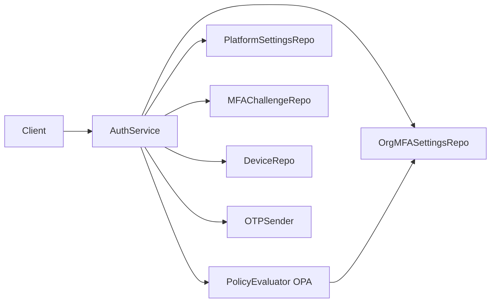

# Device Trust

This document describes device-trust logic in the zero-trust control plane backend: how devices are identifiable, revocable, and time-bound; policy evaluation (OPA/Rego) that decides when MFA is required and when to register or refresh trust; and configuration. For MFA flows (Login MFA branch, Refresh MFA branch, VerifyMFA, challenge/OTP, API), see [mfa.md](mfa.md). Business logic lives in [internal/identity/service/auth_service.go](../internal/identity/service/auth_service.go); policy evaluation is in [internal/policy/engine/](../internal/policy/engine/).

**Audience**: Developers integrating with or extending device trust or policy evaluation.

## Overview

**Device trust**: Devices are identifiable by `user_id`, `org_id`, and `fingerprint`. Trust is **revocable** (a device can be marked revoked via `revoked_at`) and **time-bound** (trust can expire via `trusted_until`). After successful MFA, the backend may register the device as trusted for a configurable number of days, depending on policy. Effective trust is: `Trusted && !RevokedAt && (TrustedUntil == nil || TrustedUntil > now)`. When a device is not effectively trusted, policy may require MFA on the next **login or refresh**; see [mfa.md](mfa.md) for the Login, Refresh, and VerifyMFA flows. On **Refresh**, the client may send **device_fingerprint**; the backend evaluates the same policy and, if MFA is required, revokes the current session and returns mfa_required or phone_required, so the user must complete MFA to obtain new tokens.

---

## Architecture

---

## Policy evaluation

### Interface

The auth service depends on a **PolicyEvaluator** interface ([internal/policy/engine/evaluator.go](../internal/policy/engine/evaluator.go)):

- **EvaluateMFA**(ctx, platformSettings, orgSettings, device, user, isNewDevice) → (**MFAResult**, error)
- **MFAResult** fields: `MFARequired` (bool), `RegisterTrustAfterMFA` (bool), `TrustTTLDays` (int).

Implementations decide whether MFA is required and, when the user completes MFA, whether to register the device as trusted and for how many days.

### OPA implementation

The default implementation is **OPAEvaluator** ([internal/policy/engine/opa_evaluator.go](../internal/policy/engine/opa_evaluator.go)):

- Loads **enabled** policies for the org from the `policies` table (Rego text in `rules`).
- Builds an **input** map from platform settings, org settings, device state, user (e.g. has_phone), and `is_new`.
- Compiles and evaluates Rego with OPA (v1 API). Queries: `data.ztcp.device_trust.mfa_required`, `data.ztcp.device_trust.register_trust_after_mfa`, `data.ztcp.device_trust.trust_ttl_days`.
- If no org policies exist or evaluation fails, uses an **embedded default Rego policy** and safe defaults (e.g. MFA not required, register trust true, TTL 30 days).

### Default Rego policy

When no org-specific policies are present, the engine uses this logic (equivalent to the embedded default in `opa_evaluator.go`):

- **mfa_required** is true if any of:
  - `input.platform.mfa_required_always`
  - `input.device.is_new` and `input.org.mfa_required_for_new_device`
  - `!input.device.is_effectively_trusted` and `input.org.mfa_required_for_untrusted`
- **register_trust_after_mfa**: from `input.org.register_trust_after_mfa` (default true).
- **trust_ttl_days**: from `input.org.trust_ttl_days` if &gt; 0; else from `input.platform.default_trust_ttl_days`.

### Input/output shape (OPA)

**Input** (JSON passed to OPA):

| Path | Description |
|------|-------------|
| `platform.mfa_required_always` | bool |
| `platform.default_trust_ttl_days` | int |
| `org.mfa_required_for_new_device` | bool |
| `org.mfa_required_for_untrusted` | bool |
| `org.mfa_required_always` | bool |
| `org.register_trust_after_mfa` | bool |
| `org.trust_ttl_days` | int |
| `device.id`, `device.trusted`, `device.trusted_until`, `device.revoked_at` | device fields |
| `device.is_new` | bool (first login for this device) |
| `device.is_effectively_trusted` | bool (trusted and not revoked and not expired) |
| `user.id`, `user.has_phone` | user fields |

**Output** (from Rego, package `ztcp.device_trust`):

| Rule/variable | Type | Meaning |
|---------------|------|---------|
| `mfa_required` | bool | Whether to require MFA before issuing session |
| `register_trust_after_mfa` | bool | Whether to mark device trusted after successful MFA |
| `trust_ttl_days` | int | Device trust TTL in days (used for `trusted_until`) |

### Settings sources

- **Platform**: [internal/platformsettings/domain/settings.go](../internal/platformsettings/domain/settings.go) `PlatformDeviceTrustSettings` — `MFARequiredAlways`, `DefaultTrustTTLDays`. Stored in `platform_settings` (key-value; keys e.g. `mfa_required_always`, `default_trust_ttl_days`). Repository: [internal/platformsettings/repository/](../internal/platformsettings/repository/).
- **Org**: [internal/orgmfasettings/domain/settings.go](../internal/orgmfasettings/domain/settings.go) `OrgMFASettings` — `MFARequiredForNewDevice`, `MFARequiredForUntrusted`, `MFARequiredAlways`, `RegisterTrustAfterMFA`, `TrustTTLDays`. One row per org in `org_mfa_settings`. Repository: [internal/orgmfasettings/repository/](../internal/orgmfasettings/repository/).

---

## Device trust

### Domain

[internal/device/domain/device.go](../internal/device/domain/device.go):

- **Trusted** (bool): whether the device is marked trusted.
- **TrustedUntil** (*time.Time): optional expiry of trust; after this time the device is not effectively trusted.
- **RevokedAt** (*time.Time): if set, the device has been revoked and is not trusted.
- **IsEffectivelyTrusted(now time.Time) bool**: returns true only if `Trusted && RevokedAt == nil && (TrustedUntil == nil || TrustedUntil.After(now))`.

### Registration after MFA

When `VerifyMFA` succeeds and policy returns `RegisterTrustAfterMFA == true` and `TrustTTLDays > 0`, the auth service calls `createSessionAndResult(ctx, userID, orgID, deviceID, true, trustTTLDays)`, which sets `trusted = true`, `trusted_until = now + trustTTLDays`, and clears `revoked_at` via [DeviceRepo.UpdateTrustedWithExpiry](../internal/device/repository/postgres.go).

### Revocation

The **DeviceService** exposes **RevokeDevice** ([proto/device/device.proto](../proto/device/device.proto), [internal/device/handler/grpc.go](../internal/device/handler/grpc.go)): it sets the device to `trusted = false`, `trusted_until = null`, `revoked_at = now`. After revocation, the device is no longer effectively trusted, so on the next login policy may require MFA again (if org requires MFA for untrusted devices).

---

## Configuration

| Variable | Description | Default |
|----------|-------------|---------|
| DEFAULT_TRUST_TTL_DAYS | Default device trust TTL in days when platform_settings has no value. | 30 |

Platform-wide settings are stored in **platform_settings** (key-value). Org-level settings are in **org_mfa_settings** (one row per org). See [database.md](database.md) for schema.

For SMS and MFA challenge TTL configuration, see [mfa.md](mfa.md#configuration).

---

## See also

- [auth.md](auth.md) — Authentication overview, Register, Login, Refresh, Logout, and public methods.
- [database.md](database.md) — Schema for platform_settings, org_mfa_settings, devices, and policies.
- [mfa.md](mfa.md) — MFA flows, challenge/OTP, API, and SMS configuration.
