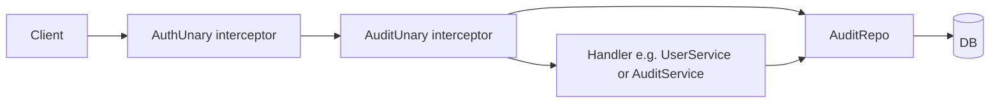
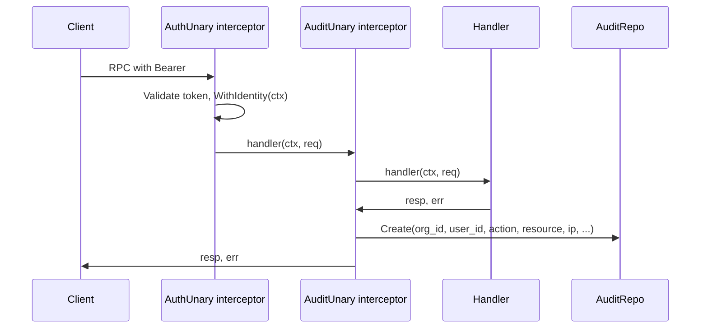

# Audit Logging

This document describes the audit logging system for the zero-trust control plane backend: purpose, what is logged, how to query, and behavior. The canonical proto is [proto/audit/audit.proto](../../../backend/proto/audit/audit.proto); the write path is implemented in [internal/server/interceptors/audit.go](../../../backend/internal/server/interceptors/audit.go); the read path is in [internal/audit/handler/grpc.go](../../../backend/internal/audit/handler/grpc.go). For interceptor order and identity in context, see [auth.md](./auth). For the `audit_logs` table and schema, see [database.md](./database).

**Audience**: Developers integrating with or extending the audit system (compliance, security review, or backend changes).

## Overview

Audit logging provides a **compliance and security trail** of who did what, when, and from where. Each auditable gRPC call results in a row in the `audit_logs` table with org, user, action, resource, client IP, and timestamp. Entries are written **best-effort**: failure to persist an audit log does not fail the RPC.

**Scope**: When auth is enabled, (1) every protected RPC (after the auth interceptor sets identity) is audited except methods in the audit skip set (e.g. HealthCheck), and (2) authentication and session lifecycle events are written explicitly from the auth service (login success/failure, logout, session created). For events that have no org (e.g. login failure before org is known, logout with invalid token), the sentinel org `_system` is used so `org_id` remains non-null.

### When audit is enabled

Audit is enabled when auth is enabled: same condition in [cmd/server/main.go](../../../backend/cmd/server/main.go) — `DATABASE_URL` and **both** `JWT_PRIVATE_KEY` and `JWT_PUBLIC_KEY` are set. When enabled, the server creates the audit repo, sets `deps.AuditRepo`, chains the audit interceptor after the auth interceptor, and registers the audit handler with the repo. ListAuditLogs and the write path (audit log creation after each audited RPC) are active.

### When audit is disabled

When auth is disabled, `deps.AuditRepo` is nil. ListAuditLogs returns **Unimplemented**, and no RPCs are audited (no audit rows are written).

---

## Architecture

**Layers**: gRPC request → AuthUnary (set identity in context) → AuditUnary (after handler, optionally Create) → Handler (e.g. UserService, AuditService) → AuditRepo (write/read) → database. In addition, the auth service uses an **AuditLogger** to write explicit events (login_success, login_failure, logout, session_created) that do not go through the interceptor with identity.

### Component diagram

### Wiring (startup)

When `authEnabled` is true, [cmd/server/main.go](../../../backend/cmd/server/main.go) does the following:

1. Opens the database and creates repos (user, identity, session, device, membership, policy, etc.).
2. Creates the audit repo with `auditrepo.NewPostgresRepository(database)` and sets `deps.AuditRepo`.
3. Builds the audit logger with `audit.NewLogger(auditRepo, interceptors.ClientIP)` and passes it into `NewAuthService(..., auditLogger)` so login/logout and session_created are audited.
4. Builds `auditSkipMethods` with at least `HealthService_HealthCheck_FullMethodName`.
5. Creates the gRPC server with `grpc.ChainUnaryInterceptor(interceptors.AuthUnary(tokens, publicMethods), interceptors.AuditUnary(deps.AuditRepo, auditSkipMethods))`.

[internal/server/grpc.go](../../../backend/internal/server/grpc.go) `RegisterServices` passes `deps.AuditRepo` into `audithandler.NewServer(deps.AuditRepo)`. If `deps.AuditRepo == nil` (auth disabled), the audit handler returns Unimplemented for ListAuditLogs and no RPCs are audited.

### Request path (audited RPC)

For an audited RPC, the request passes through the auth interceptor (which sets user_id, org_id, session_id in context), then the audit interceptor, then the handler. After the handler returns, the audit interceptor writes an audit log entry if the method is not in the skip set and org_id is set.

---

## API Surface

### RPCs

| RPC | Request | Response | Notes |
|-----|---------|----------|-------|
| ListAuditLogs | ListAuditLogsRequest | ListAuditLogsResponse | Caller must be authenticated; org from context. Optional filters: user_id, action, resource. Pagination: page_size (default 50, max 100), page_token (opaque offset). |

### Messages

- **ListAuditLogsRequest**: `org_id` (optional; if set must match context org), `pagination` (page_size, page_token), optional filters `user_id`, `action`, `resource`.
- **ListAuditLogsResponse**: `logs` (repeated AuditEvent), `pagination` (next_page_token).
- **AuditEvent**: `id`, `org_id`, `user_id`, `action`, `resource`, `ip`, `metadata`, `created_at` (Timestamp).

### Pagination

- **page_size**: Default 50, max 100. Number of audit events per page.
- **page_token**: Opaque token for the next page (offset). Omit or empty for first page.
- **next_page_token**: Set when there are more results (i.e. returned count equals page_size). Client passes this as page_token for the next request.

### Errors

The handler maps conditions to gRPC status codes in [internal/audit/handler/grpc.go](../../../backend/internal/audit/handler/grpc.go):

| Condition | gRPC code |
|-----------|-----------|
| No org in context (unauthenticated or missing org) | Unauthenticated |
| req.org_id set and not equal to context org | PermissionDenied |
| Repository list failed | Internal |

---

## What is logged

Each audit log entry contains:

| Field      | Source |
|-----------|--------|
| `id`      | UUID generated per event |
| `org_id`  | From auth context (required; only authenticated calls are logged) |
| `user_id` | From auth context (empty if unset) |
| `action`  | Derived from gRPC method name (e.g. get, list, create, update, delete) |
| `resource`| Derived from gRPC service name (e.g. user, organization, device, policy) |
| `ip`      | Client IP from `x-forwarded-for`, `x-real-ip`, or gRPC peer; `"unknown"` if absent |
| `metadata`| Reserved for future use (currently empty) |
| `created_at` | Server time (UTC) when the entry was created |

### Method-to-action/resource mapping

Action and resource are derived from the gRPC full method name (e.g. `/ztcp.user.v1.UserService/GetUser`):

- **Action**: Inferred from the method name. Common mappings: `Get*` → `get`, `List*` → `list`, `Create*` → `create`, `Update*` → `update`, `Delete*` → `delete`, `Add*` → `add`, `Remove*` → `remove`, `Register*` → `register`, `Revoke*` → `revoke`, `Suspend*` → `suspend`. Others fall back to the lowercase method name.
- **Resource**: Taken from the service name with `Service` stripped and lowercased (e.g. `UserService` → `user`, `OrganizationService` → `organization`, `AuditService` → `audit`).

The mapping logic lives in [internal/audit/mapping.go](../../../backend/internal/audit/mapping.go).

### Action/resource reference (examples)

| Service | Method (example) | action | resource |
|---------|------------------|--------|----------|
| UserService | GetUser, ListUsers, DisableUser, EnableUser | get, list, (lowercase) | user |
| OrganizationService | CreateOrganization, GetOrganization, ListOrganizations, SuspendOrganization | create, get, list, suspend | organization |
| DeviceService | RegisterDevice, GetDevice, ListDevices, RevokeDevice | register, get, list, revoke | device |
| PolicyService | CreatePolicy, UpdatePolicy, DeletePolicy, ListPolicies | create, update, delete, list | policy |
| SessionService | RevokeSession, ListSessions, GetSession | revoke, list, get | session |
| MembershipService | AddMember, RemoveMember, UpdateRole | user_added, user_removed, role_changed | user |
| MembershipService | ListMembers | list | membership |
| AuditService | ListAuditLogs | list | audit |

### Explicit audit events (AuthService)

The auth service logs the following via [internal/audit/logger.go](../../../backend/internal/audit/logger.go) (best-effort; failures do not fail the RPC):

| action | resource | When |
|--------|----------|------|
| login_success | authentication | Login returns tokens or MFA required; metadata may include `{"role":"owner"}` or `{"role":"admin"}` for admin login. |
| login_failure | authentication | Login fails (invalid credentials, not org member, etc.); org_id from request or sentinel. |
| logout | authentication | Logout revokes a session; org_id/user_id from the revoked session or sentinel if unknown. |
| session_created | session | A session is created (Login, VerifyMFA, or Refresh issues tokens). |

**Sentinel org**: Events that have no org (e.g. login_failure when org is empty, logout with invalid token) use `org_id = "_system"`. The sentinel organization is created by migration [007_system_org.up.sql](../../../backend/internal/db/migrations/007_system_org.up.sql). ListAuditLogs for `org_id = "_system"` returns these system-level auth events.

**Critical config**: Policy create/update/delete are audited by the interceptor (action create, update, delete; resource policy) and count as critical config changes. MFA policy, device trust, and domain allow/block changes are covered when they are performed via PolicyService or future org/platform settings RPCs. Per-user MFA enabled/disabled (resource security, actions mfa_enabled/mfa_disabled) should be audited when that feature is implemented.

---

## Skip set

Methods in the audit skip set are not written to the audit log. At least **HealthCheck** is skipped to avoid noise. Other methods (e.g. ListAuditLogs) can be skipped or audited; currently only HealthCheck is in the skip set. The skip set is configured in [cmd/server/main.go](../../../backend/cmd/server/main.go) as `auditSkipMethods` passed to `AuditUnary`.

## Best-effort write

If `auditRepo.Create` fails (e.g. database error), the error is logged with `log.Printf` and the original RPC response and error are returned unchanged. Audit logging does not affect RPC availability.

---

## Configuration

There are no dedicated audit environment variables. Audit is on when auth is on: the same `DATABASE_URL`, `JWT_PRIVATE_KEY`, and `JWT_PUBLIC_KEY` that enable auth enable the audit repo and interceptor. Adding or removing methods from the audit skip set is done in code in [cmd/server/main.go](../../../backend/cmd/server/main.go) (`auditSkipMethods`).

---

## Database

The `audit_logs` table is defined in [internal/db/migrations/001_schema.up.sql](../../../backend/internal/db/migrations/001_schema.up.sql) and [internal/db/sqlc/schema/001_schema.sql](../../../backend/internal/db/sqlc/schema/001_schema.sql). Queries are in [internal/db/sqlc/queries/audit_log.sql](../../../backend/internal/db/sqlc/queries/audit_log.sql); generated code in [internal/db/sqlc/gen/audit_log.sql.go](../../../backend/internal/db/sqlc/gen/audit_log.sql.go). The repository is implemented in [internal/audit/repository/postgres.go](../../../backend/internal/audit/repository/postgres.go). For the full schema and table relationships, see [database.md](./database).
