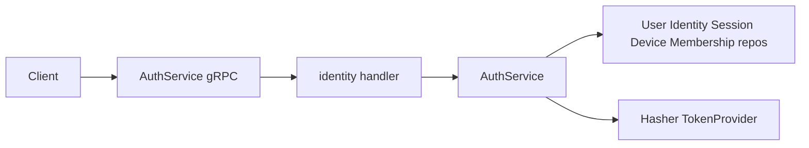
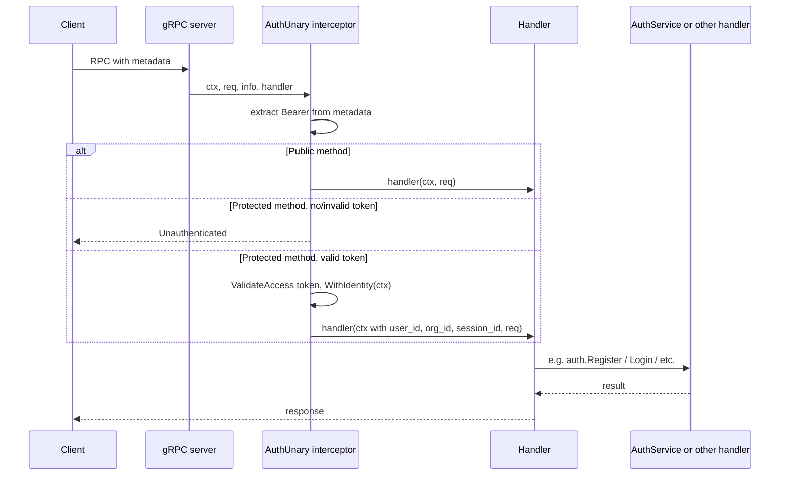

# Auth Implementation

This document describes the authentication implementation for the zero-trust control plane backend: architecture, API surface, security measures, flows, and configuration. The canonical proto is [internal/proto/auth/auth.proto](../../../backend/proto/auth/auth.proto); business logic lives in [internal/identity/service/auth_service.go](../../../backend/internal/identity/service/auth_service.go); the gRPC server is implemented in [internal/identity/handler/grpc.go](../../../backend/internal/identity/handler/grpc.go).

**Audience**: Developers integrating with or extending the auth system (clients, tests, or backend changes).

## Overview

Auth provides **password-only** authentication for Browser and Admin UI with enterprise-grade security: bcrypt password hashing, JWT access and refresh tokens (RS256/ES256), refresh-token rotation, session binding via `refresh_jti` and hashed refresh token, refresh reuse detection (revoke all user sessions on reuse), and strong password policy (12+ chars, mixed case, number, symbol).

**Scope**: Register, Login (with optional risk-based MFA), **VerifyCredentials** (credential verification without session/org check, for create-org flow), VerifyMFA, Refresh, and Logout are implemented. **LinkIdentity** is reserved for future OIDC/SAML and currently returns Unimplemented. For detailed MFA and device-trust logic (when MFA is required, policy evaluation, OTP flow, device trust registration and revocation), see [mfa.md](./mfa) and [device-trust.md](./device-trust).

### When auth is enabled

Auth is enabled when `DATABASE_URL` and **both** `JWT_PRIVATE_KEY` and `JWT_PUBLIC_KEY` are set. See [cmd/server/main.go](../../../backend/cmd/server/main.go) line 43: `authEnabled := cfg.DatabaseURL != "" && cfg.JWTPrivateKey != "" && cfg.JWTPublicKey != ""`. When enabled, the server opens the database, builds the auth service and repos, registers the auth interceptor, and auth RPCs are fully functional.

### When auth is disabled

If any of the three (DATABASE_URL, JWT_PRIVATE_KEY, JWT_PUBLIC_KEY) is missing: no database connection is opened, no auth service is created, no auth interceptor is registered, and auth RPCs (Register, Login, Refresh, Logout, LinkIdentity) return **Unimplemented**. All other gRPC methods remain callable without a Bearer token.

---

## Architecture

**Layers**: gRPC AuthService (proto) → identity handler (proto ↔ domain) → auth service (business logic) → repos (user, identity, session, device, membership) and security (hasher, token provider).

### Wiring (startup)

When `authEnabled` is true, [cmd/server/main.go](../../../backend/cmd/server/main.go) does the following:

1. Opens the database with `db.Open(cfg.DatabaseURL)`.
2. Creates the hasher with `security.NewHasher(cfg.BcryptCost)`.
3. Parses JWT keys via [internal/security/keys.go](../../../backend/internal/security/keys.go) `ParsePrivateKey` and `ParsePublicKey` (supports inline PEM or file path; see `LoadPEM`).
4. Builds `TokenProvider` with issuer, audience, and TTLs from config.
5. Creates the five repos (user, identity, session, device, membership) and other repos (platform settings, org MFA settings, MFA challenge/intent, policy). Creates the audit repo and audit logger; see [audit.md](./audit). Calls `NewAuthService(..., auditLogger)` and sets `deps.Auth`, `deps.DeviceRepo`, `deps.PolicyRepo`, `deps.AuditRepo`, `deps.HealthPinger`, `deps.HealthPolicyChecker`.
6. Builds `publicMethods` with the six full method names: AuthService Register, Login, VerifyCredentials, VerifyMFA, Refresh; HealthService HealthCheck.
7. Creates the gRPC server with `grpc.ChainUnaryInterceptor(interceptors.AuthUnary(tokens, publicMethods), interceptors.AuditUnary(deps.AuditRepo, auditSkipMethods))`. See [audit.md](./audit) for the audit skip set and when audit is written.

[internal/server/grpc.go](../../../backend/internal/server/grpc.go) `RegisterServices` passes `deps.Auth` into `identityhandler.NewAuthServer(authSvc)`. If `deps.Auth == nil` (auth disabled), the handler returns Unimplemented for all auth RPCs.

### Component diagram

### Request path (protected RPC)

For a protected RPC, the request passes through the auth interceptor before the handler. Public methods (Register, Login, VerifyCredentials, VerifyMFA, Refresh, HealthCheck) skip Bearer validation and proceed even with no or invalid token.

---

## API Surface

### RPCs

| RPC | Request | Response | AuthResponse contents | Notes |
|-----|--------|----------|------------------------|-------|
| Register | RegisterRequest | AuthResponse | `user_id` only | No tokens or org_id until Login with org. |
| VerifyCredentials | VerifyCredentialsRequest | VerifyCredentialsResponse | `user_id` only | Validates email/password; returns user_id only. Does not check org membership; no tokens. Public; used for create-org flow (e.g. from login page). |
| Login | LoginRequest | **LoginResponse** | oneof: **tokens**, **mfa_required** (challenge_id, phone_mask), or **phone_required** (intent_id) | If policy requires MFA and user has phone, returns mfa_required; if MFA required but user has no phone, returns phone_required; else returns tokens. |
| VerifyMFA | VerifyMFARequest | AuthResponse | access_token, refresh_token, expires_at, user_id, org_id | Completes MFA; validates challenge and OTP, creates session, optionally marks device trusted; on first-time phone, sets user.phone and phone_verified. Returns tokens. |
| SubmitPhoneAndRequestMFA | SubmitPhoneAndRequestMFARequest | SubmitPhoneAndRequestMFAResponse | challenge_id, phone_mask | Consumes intent from Login(phone_required); creates MFA challenge for submitted phone, sends OTP; returns challenge_id and phone_mask. Client then calls VerifyMFA. |
| Refresh | RefreshRequest | **RefreshResponse** | oneof: **tokens**, **mfa_required**, or **phone_required** | When policy does not require MFA: rotate tokens and return tokens. When policy requires MFA: revoke current session and return mfa_required or phone_required; client completes MFA (VerifyMFA or SubmitPhoneAndRequestMFA then VerifyMFA) to obtain new tokens. |
| Logout | LogoutRequest | google.protobuf.Empty | — | Revokes session by refresh_token or by Bearer context. |
| LinkIdentity | LinkIdentityRequest | LinkIdentityResponse | — | Stub; returns Unimplemented. |

### Public methods (no Bearer required)

The following full method names are treated as public; they do not require a valid Bearer token. Any other method requires a valid Bearer (access) token.

- `AuthService_Register_FullMethodName`
- `AuthService_Login_FullMethodName`
- `AuthService_VerifyCredentials_FullMethodName`
- `AuthService_VerifyMFA_FullMethodName`
- `AuthService_SubmitPhoneAndRequestMFA_FullMethodName`
- `AuthService_Refresh_FullMethodName`
- `HealthService_HealthCheck_FullMethodName`

These are configured in [cmd/server/main.go](../../../backend/cmd/server/main.go) in the `publicMethods` map passed to the auth interceptor.

### Messages

- **RegisterRequest**: `email`, `password`, optional `name`.
- **VerifyCredentialsRequest**: `email`, `password`. Used to obtain `user_id` for CreateOrganization without issuing tokens or checking org membership.
- **VerifyCredentialsResponse**: `user_id` (set when credentials are valid).
- **LoginRequest**: `email`, `password`, `org_id` (required), optional `device_fingerprint` (used to get-or-create device for the session).
- **RefreshRequest**: `refresh_token`; optional `device_fingerprint` (used to evaluate device-trust policy, same semantics as Login; default `"password-login"` if omitted).
- **RefreshResponse**: oneof **result** — **tokens** (AuthResponse), **mfa_required** (MFARequired), or **phone_required** (PhoneRequired). Same shape as LoginResponse. Returned when device-trust policy is evaluated on Refresh; when MFA is required, the current session is revoked and the client must complete MFA to get new tokens.
- **LogoutRequest**: optional `refresh_token`; if empty, the session is revoked from context when the client sends a valid Bearer (access) token (auth interceptor sets session_id in context).
- **AuthResponse**: `access_token`, `refresh_token`, `expires_at` (Timestamp), `user_id`, `org_id`. Fields may be empty depending on RPC: Register returns only `user_id`; Login (when tokens), VerifyMFA, and Refresh (when tokens) return all fields.
- **LoginResponse**: oneof **result** — **tokens** (AuthResponse), **mfa_required** (MFARequired), or **phone_required** (PhoneRequired). When MFA is required and user has phone, client uses challenge_id and phone_mask and calls VerifyMFA. When MFA required but user has no phone, client gets intent_id, prompts for phone, calls SubmitPhoneAndRequestMFA, then VerifyMFA.
- **MFARequired**: `challenge_id` (opaque id for VerifyMFA), `phone_mask` (e.g. last 4 digits for display).
- **PhoneRequired**: `intent_id` (one-time; pass to SubmitPhoneAndRequestMFA with user-entered phone).
- **SubmitPhoneAndRequestMFARequest**: `intent_id` (from Login phone_required), `phone` (user-entered).
- **SubmitPhoneAndRequestMFAResponse**: `challenge_id`, `phone_mask` (then call VerifyMFA with challenge_id and OTP).
- **VerifyMFARequest**: `challenge_id` (from Login mfa_required or SubmitPhoneAndRequestMFA), `otp` (user-entered code).
- **Logout**: returns `google.protobuf.Empty`.

### Errors

The handler maps auth-service sentinel errors to gRPC status codes in [internal/identity/handler/grpc.go](../../../backend/internal/identity/handler/grpc.go) `authErr()` (switch on sentinels from [auth_service.go](../../../backend/internal/identity/service/auth_service.go)):

| Service error | gRPC code |
|---------------|-----------|
| ErrEmailAlreadyRegistered | AlreadyExists |
| ErrInvalidCredentials | Unauthenticated |
| ErrInvalidRefreshToken | Unauthenticated |
| ErrRefreshTokenReuse | Unauthenticated |
| ErrNotOrgMember | PermissionDenied |
| ErrPhoneRequiredForMFA | FailedPrecondition |
| ErrInvalidMFAChallenge, ErrInvalidOTP | Unauthenticated |
| ErrInvalidMFAIntent | Unauthenticated |
| ErrChallengeExpired | FailedPrecondition |
| Validation (email, password, etc.) | InvalidArgument |

Login returns a generic "invalid credentials" on failure so that "user not found" and "wrong password" are indistinguishable.

---

## Security

### Passwords

- **Hashing**: [internal/security/hashing.go](../../../backend/internal/security/hashing.go) uses bcrypt. Cost is configurable (default 12). Comparison is constant-time via `bcrypt.CompareHashAndPassword`. Callers must not log or persist plaintext passwords.
- **Policy**: Min 12 characters; at least one uppercase, one lowercase, one number, and one symbol (non-alphanumeric). Enforced on Register.
- **Validation**: Email and password validation live in [auth_service.go](../../../backend/internal/identity/service/auth_service.go) as `validateEmail` (simple regex) and `validatePassword` (length and character classes).

### Tokens

- **Implementation**: [internal/security/tokens.go](../../../backend/internal/security/tokens.go) uses **RS256/ES256** (asymmetric: `JWT_PRIVATE_KEY` + `JWT_PUBLIC_KEY`). The algorithm is chosen from the key type in `sign()`: RSA public key → RS256, ECDSA public key → ES256. Issuer (`iss`) and audience (`aud`) are set on all tokens and validated on refresh.
- **Key loading**: Keys can be inline PEM (string starting with `-----BEGIN`) or a file path; [internal/security/keys.go](../../../backend/internal/security/keys.go) `LoadPEM` treats a value that looks like PEM as inline, otherwise reads from the filesystem.
- **Access token**: Short-lived. Claims: `jti`, `sub` (user_id), `org_id`, `session_id`, `iss`, `aud`, `exp`, `iat`.
- **Refresh token**: Long-lived. Claims: `session_id`, `jti` (unique id for rotation), `sub`, `org_id`, `iss`, `aud`, `exp`, `iat`.

### Refresh token hash

The current refresh token is hashed (SHA-256, hex) and stored in **sessions.refresh_token_hash**. [internal/security/refresh_hash.go](../../../backend/internal/security/refresh_hash.go) provides `HashRefreshToken(token)` and `RefreshTokenHashEqual(providedToken, storedHash)`; the comparison is constant-time. If the DB leaks, attackers cannot use refresh tokens without the actual token string. Migration [internal/db/migrations/004_refresh_token_hash.up.sql](../../../backend/internal/db/migrations/004_refresh_token_hash.up.sql) adds the column. Legacy sessions (empty hash) allow jti-only check until next rotation.

### Refresh rotation and reuse detection

On **Refresh**, the service validates the refresh JWT (signature, exp, iss, aud), loads the session by `session_id`, and verifies the session is not revoked. If `session.refresh_jti != token jti` (old token reused after rotation), the service **revokes all sessions for that user** and returns `ErrRefreshTokenReuse` (possible compromise). Otherwise it verifies the refresh token hash (when stored), then issues new access and refresh tokens (new jti), updates `session.refresh_jti` and `session.refresh_token_hash`, and returns the new AuthResponse.

Refresh also accepts optional **device_fingerprint**. When provided, the service resolves the device by (user_id, org_id, fingerprint) (get-or-create), loads platform and org MFA/device-trust settings, and runs **PolicyEvaluator.EvaluateMFA** (same as Login). If the result requires MFA, the service **revokes the current session**, creates an MFA challenge or phone intent as in Login, and returns **RefreshResponse** with **mfa_required** or **phone_required** instead of rotating tokens. The client then completes MFA via VerifyMFA (or SubmitPhoneAndRequestMFA then VerifyMFA) to obtain a new session and tokens.

### Auth interceptor

A unary gRPC interceptor ([internal/server/interceptors/auth.go](../../../backend/internal/server/interceptors/auth.go)) runs when auth is enabled.

- **Bearer extraction**: It reads the gRPC metadata key `authorization` and expects `Bearer <access_token>` (case-insensitive "bearer" prefix), per `extractBearer`. Leading/trailing space is trimmed.
- **Public methods**: If the RPC is in `publicMethods`, the request is allowed through even when the token is missing or invalid; identity is not set in context.
- **Protected methods**: If the RPC is not public and the client does not send a valid Bearer token (missing or `TokenProvider.ValidateAccess` fails), the interceptor returns `Unauthenticated` immediately and the handler is not called.
- **Valid token**: On successful `ValidateAccess`, the interceptor calls `WithIdentity(ctx, userID, orgID, sessionID)`. Handlers and the auth service read identity via [internal/server/interceptors/context.go](../../../backend/internal/server/interceptors/context.go) `GetUserID`, `GetOrgID`, and `GetSessionID`. Logout with empty `refresh_token` revokes the session from context when the caller sent a valid Bearer token.
- **SessionValidator (optional)**: When auth is enabled, the interceptor may be given a **SessionValidator** function. After `ValidateAccess(token)` succeeds, the interceptor calls the validator with the extracted `session_id`. If the validator returns false (session missing or revoked) or an error, the interceptor returns **Unauthenticated** and the handler is not called. The validator is wired in [cmd/server/main.go](../../../backend/cmd/server/main.go) from `SessionRepo.GetByID` and `session.RevokedAt`. So access tokens for revoked sessions are rejected immediately (no need to wait for expiry). See [sessions.md](./sessions) for token invalidation details.

### Session binding and revocation

The **sessions** table includes nullable `refresh_jti` and `refresh_token_hash`. See [internal/db/sqlc/schema/001_schema.sql](../../../backend/internal/db/sqlc/schema/001_schema.sql) and migrations 003 and 004. Apply migrations 003 and 004 when adding auth to an existing database.

**Session revocation**: Revoking a session (SessionService [RevokeSession](./sessions) or RevokeAllSessionsForUser) sets `sessions.revoked_at`. **Refresh** already rejects revoked sessions (ErrInvalidRefreshToken). With the optional **SessionValidator**, protected RPCs also reject requests that carry an access token for a revoked session (Unauthenticated → 401). Clients (e.g. web dashboard) should treat 401 as session invalid and clear auth state and redirect to login. See [sessions.md](./sessions) for full details.

### Validation

- **Register**: Email format (simple regex) and password strength (12+ chars, upper, lower, number, symbol).
- **Login**: Generic "invalid credentials" for wrong password or missing user/identity to avoid leaking account existence.

---

## Flows

### Register

1. Validate email format and password strength (via `validateEmail` and `validatePassword` in [auth_service.go](../../../backend/internal/identity/service/auth_service.go)).
2. Ensure no user exists with the given email (return AlreadyExists if so).
3. Create user (status active) and local identity (provider `local`, provider_id = email, bcrypt-hashed password).
4. Return AuthResponse with `user_id` only (no tokens or org_id). **No organization or membership is created.**

After registration, the user can obtain access by creating an org (from the **login page** "Create new" tab via VerifyCredentials + CreateOrganization, or with the `user_id` from Register) or by joining an existing org:

**Option 1: Create a new organization** (recommended for new users):
- Call `OrganizationService.CreateOrganization` with the `user_id` and an organization name. The `user_id` may come from Register or from **VerifyCredentials** (e.g. when creating an org from the login page).
- The system creates the organization with `active` status and assigns the user as `owner`.
- The user can then log in using the returned organization `id` as `org_id`.
- See [Organization Creation Flow](../organization-membership#organization-creation-flow) for details.

**Option 2: Join an existing organization**:
- An organization owner or admin adds the user via `MembershipService.AddMember`.
- After membership is created, the user can log in with that organization's `id` as `org_id`.

### VerifyCredentials

Validates email and password the same way as Login (user lookup, local identity, bcrypt compare) but does **not** require `org_id` and does **not** check org membership or issue tokens. Returns **VerifyCredentialsResponse** with `user_id` when credentials are valid. Used by the frontend create-org-from-login flow: the client calls VerifyCredentials to obtain `user_id`, then calls `OrganizationService.CreateOrganization` with that `user_id` and an org name, then logs in with the new org. Both newly registered users and already-registered users can create an org from the login page using this flow.

### Login

1. Validate email, password, and org_id (non-empty).
2. Get user by email; get local identity by user and provider; compare password (constant-time). Return invalid credentials on any failure.
3. Require org_id and validate membership via `GetMembershipByUserAndOrg`. If no membership, return `ErrNotOrgMember` → PermissionDenied.
4. Get or create device: if `device_fingerprint` is provided, look up by user/org/fingerprint; if not found, create. If not provided, use fingerprint `"password-login"` and create device if needed ([auth_service.go](../../../backend/internal/identity/service/auth_service.go)).
5. Load platform and org MFA/device-trust settings (from `platform_settings` and `org_mfa_settings`) and run policy evaluation (`PolicyEvaluator.EvaluateMFA`). See [mfa.md](./mfa) and [device-trust.md](./device-trust).
6. **If MFA required**: If user has no phone, create MFA intent and return **LoginResponse** with **phone_required** (intent_id); client collects phone and calls SubmitPhoneAndRequestMFA, then VerifyMFA. If user has phone, create MFA challenge, send OTP (if SMS configured); return **LoginResponse** with **mfa_required** (challenge_id, phone_mask). Client then calls VerifyMFA with challenge_id and OTP.
7. **If MFA not required**: Create session with id, user_id, org_id, device_id, expires_at, and **refresh_jti** and **refresh_token_hash** from the first refresh token; issue access and refresh JWTs; return **LoginResponse** with **tokens** (AuthResponse).

### Organization Creation After Registration

After a user successfully registers and receives a `user_id`, they can create an organization to get started. This flow enables self-service organization setup:

1. **User registers** via `AuthService.Register` and receives `user_id`.
2. **User creates organization** by calling `OrganizationService.CreateOrganization` with:
   - `name`: The desired organization name
   - `user_id`: The `user_id` received from registration
3. **System processes creation**:
   - Validates that the user exists
   - Creates organization with `active` status (auto-activated for PoC)
   - Creates membership record with `role=owner` for the creating user
   - Returns the created organization with its `id`
4. **User logs in** using:
   - Email and password (from registration)
   - `org_id`: The organization `id` returned from `CreateOrganization`

**Why CreateOrganization is public**: This endpoint does not require authentication (no Bearer token) because users need to create organizations before they can log in and obtain tokens. The system validates that the `user_id` exists to ensure only registered users can create organizations.

**Auto-activation**: For the PoC, organizations are automatically activated (`status=ACTIVE`) upon creation. In production, this would typically require platform administrator approval before the organization becomes active.

**Owner assignment**: The creating user is automatically assigned the `owner` role, giving them full administrative control over the organization. They can add members, configure policies, manage sessions, and perform all org-admin operations.

**Alternative**: Users can also be added to existing organizations by organization owners/admins via `MembershipService.AddMember`, then log in with that organization's `id`.

### VerifyMFA

1. Validate challenge_id and otp (non-empty). Load MFA challenge by id; return Unauthenticated if not found.
2. Check challenge not expired; return FailedPrecondition if expired. Verify OTP (constant-time) against stored code_hash; return Unauthenticated if mismatch.
3. If user has no phone (first-time), call UserRepo.SetPhoneVerified(userID, challenge.Phone) so the user's phone is set and locked (phone_verified = true); one phone per user, immutable after verification.
4. Re-evaluate policy for register_trust_after_mfa and trust_ttl_days; create session and issue tokens; if policy says register trust, mark device trusted with trust_ttl_days.
5. Delete the MFA challenge; return AuthResponse with tokens.

### Refresh

1. **JWT validation first** (no DB): validate refresh JWT (signature, exp, iss, aud) and parse session_id and jti.
2. Load session; if not found or revoked, return ErrInvalidRefreshToken. **Reuse check**: if `session.refresh_jti != jti` (old token reused after rotation), revoke all sessions for that user and return ErrRefreshTokenReuse.
3. If session has refresh_token_hash, require `RefreshTokenHashEqual(provided token, session.refresh_token_hash)`; else allow (legacy).
4. Resolve device: optional **device_fingerprint** (default `"password-login"`); get-or-create device by (user_id, org_id, fingerprint).
5. Load user, platform device-trust settings, org MFA settings; run **PolicyEvaluator.EvaluateMFA** (same inputs as Login).
6. **If MFA required**: Revoke current session. If user has no phone: create MFA intent, return **RefreshResponse** with **phone_required** (intent_id). Else: create MFA challenge, send OTP if configured; return **RefreshResponse** with **mfa_required** (challenge_id, phone_mask). Client completes MFA as after Login.
7. **If MFA not required**: Update session last_seen; rotate refresh token (new jti, new refresh token hash); issue new access and refresh tokens; return **RefreshResponse** with **tokens** (AuthResponse).

### Logout

**Logout is a protected method**: the client must send a valid Bearer (access) token so the interceptor sets identity and the handler (and audit logger) run. Clients such as the BFF should send `Authorization: Bearer <access_token>` when calling Logout.

Two paths:

1. **refresh_token provided**: Validate refresh JWT and parse session_id; revoke that session (set revoked_at). If validation fails, the handler returns success anyway (no error to caller).
2. **refresh_token empty**: If the auth interceptor set session_id in context (client sent a valid Bearer access token), revoke that session via `interceptors.GetSessionID(ctx)`; otherwise no-op.

In both cases the RPC returns Empty. The auth service logs a logout audit event with the session's org_id and user_id when the session is revoked.

---

## Configuration

Auth is enabled when `DATABASE_URL` and **both** `JWT_PRIVATE_KEY` and `JWT_PUBLIC_KEY` are set. The following env vars are used:

| Variable | Description | Default |
|----------|-------------|---------|
| GRPC_ADDR | Address the gRPC server listens on (e.g. `:8080`). | `:8080` |
| DATABASE_URL | Postgres DSN; **required** when auth is enabled. | (none) |
| JWT_PRIVATE_KEY | PEM-encoded private key (RSA or ECDSA) or path to file; **required** when auth is enabled. | (none) |
| JWT_PUBLIC_KEY | PEM-encoded public key or path to file; **required** when auth is enabled. | (none) |
| JWT_ISSUER | Issuer claim (e.g. `ztcp-auth`). | `ztcp-auth` |
| JWT_AUDIENCE | Audience claim (e.g. `ztcp-api`). | `ztcp-api` |
| JWT_ACCESS_TTL | Access token lifetime (e.g. `15m`). | `15m` |
| JWT_REFRESH_TTL | Refresh token lifetime (e.g. `168h` for 7 days). | `168h` |
| BCRYPT_COST | Bcrypt cost factor (4–31). | `12` |

**JWT keys**: Values can be either inline PEM (string starting with `-----BEGIN`) or a file path; [internal/security/keys.go](../../../backend/internal/security/keys.go) `LoadPEM` treats a value that looks like PEM as inline, otherwise reads from the filesystem.

**AccessTTL / RefreshTTL**: Parsed in [internal/config/config.go](../../../backend/internal/config/config.go) via `AccessTTL()` and `RefreshTTL()` (Go `time.ParseDuration`). If unset or invalid, they fall back to 15 minutes and 168 hours (7 days) respectively.

Config is loaded in [internal/config/config.go](../../../backend/internal/config/config.go) (Viper: optional `.env` file, then env). See [.env.example](../../../backend/.env.example) for a template. For production, load the private key from KMS/Vault (e.g. env populated by sidecar or startup script).

---

## MFA and device trust

Login may return **mfa_required** instead of tokens when policy requires a second factor (e.g. new device, untrusted device, or org/platform mandate). The client then calls **VerifyMFA** with the challenge_id and user-entered OTP to complete login. Device trust is identifiable (user/org/fingerprint), revocable (`revoked_at`), and time-bound (`trusted_until`); after successful MFA the backend may register the device as trusted for a configurable TTL. For full detail (policy evaluation, OPA/Rego, OTP and SMS, configuration), see [mfa.md](./mfa) and [device-trust.md](./device-trust).

---

## Database and Schema

Auth uses the **users**, **identities**, **memberships**, **devices**, **sessions**, **platform_settings**, **org_mfa_settings**, and **mfa_challenges** tables. Full schema and table definitions are in [database.md](./database). Apply migrations 003, 004, and 005 when adding auth to an existing database so that `sessions.refresh_jti`, `sessions.refresh_token_hash`, and MFA/device-trust columns and tables exist.

### Table roles (auth)

| Table | Role in auth |
|-------|----------------|
| **users** | id, email, name, status, **phone** (optional; used for MFA), **phone_verified** (locked after first MFA); one phone per user, immutable after verification. Created by Register; looked up by email on Login. |
| **identities** | user_id, provider (`local`), provider_id (email), password_hash; local identity created by Register; Login uses GetByUserAndProvider and compares password. |
| **memberships** | user_id, org_id, role; required for Login (GetMembershipByUserAndOrg); no membership → PermissionDenied. |
| **devices** | user_id, org_id, fingerprint, **trusted**, **trusted_until**, **revoked_at**; get-or-create per Login and per Refresh (when device_fingerprint sent); used for MFA/device-trust policy and optional trust registration after VerifyMFA. |
| **sessions** | user_id, org_id, device_id, expires_at, revoked_at, last_seen_at, **refresh_jti**, **refresh_token_hash**; created on Login or after VerifyMFA; refreshed via UpdateRefreshToken; revoked on Logout, reuse, or when Refresh returns MFA required. |
| **platform_settings** | key-value; platform-wide MFA/device-trust settings (e.g. mfa_required_always, default_trust_ttl_days) used by policy evaluation. |
| **org_mfa_settings** | one row per org; org-level MFA/device-trust settings (mfa_required_for_new_device, mfa_required_for_untrusted, register_trust_after_mfa, trust_ttl_days, etc.) used by policy evaluation. Auth & MFA and Device Trust sections of **org_policy_config** are synced here on update (see [org-policy-config](./org-policy-config)). |
| **mfa_intents** | one-time intents (id, user_id, org_id, device_id, expires_at); created when Login or Refresh returns phone_required (user has no phone); consumed by SubmitPhoneAndRequestMFA. |
| **mfa_challenges** | ephemeral MFA challenges (id, user_id, org_id, device_id, phone, code_hash, expires_at); created when Login or Refresh returns mfa_required or after SubmitPhoneAndRequestMFA; deleted after successful VerifyMFA or expiry. |
| **org_policy_config** | one row per org; JSON config for policy UI (five sections). Not used directly by auth; Auth & MFA and Device Trust sections sync to org_mfa_settings. See [org-policy-config](./org-policy-config). |

---

## Testing

Unit tests cover:

- **Hashing**: [internal/security/hashing_test.go](../../../backend/internal/security/hashing_test.go) — Hash/Compare, wrong password, cost.
- **Tokens**: [internal/security/tokens_test.go](../../../backend/internal/security/tokens_test.go) — IssueAccess, IssueRefresh, ValidateRefresh, ValidateAccess, invalid token.
- **Auth service**: [internal/identity/service/auth_service_test.go](../../../backend/internal/identity/service/auth_service_test.go) — Register (success and duplicate email), validation failures, Login requires membership, Login/Refresh/Logout flow, Logout from context (session_id in context), wrong password. Uses in-memory stub repos. Auth RPCs (Register, Login, Refresh) are public, so tests can call them without a Bearer token.

---

## Future

- **LinkIdentity**: Implement for OIDC/SAML; link external identity to user and store provider_id/id_token or assertion.
- **Membership**: AddMember, RemoveMember, UpdateRole, and ListMembers are implemented and used by the org admin dashboard. See [Web dashboard (org admin)](/docs/frontend/dashboard) and [sessions](./sessions) for how the dashboard manages members and sessions.
