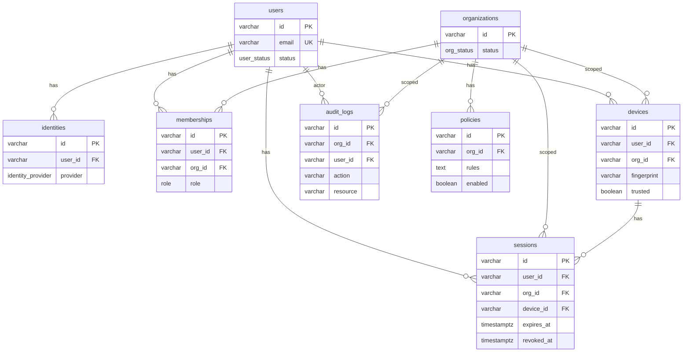

# Database Structure

This document describes the current PostgreSQL schema for the zero-trust control plane backend. The canonical schema is maintained in [internal/db/sqlc/schema/001_schema.sql](../../../backend/internal/db/sqlc/schema/001_schema.sql) and applied via [internal/db/migrations/](../../../backend/internal/db/migrations/). For MFA and device-trust behavior (when MFA is required, policy evaluation, OTP flow), see [mfa.md](./mfa) and [device-trust.md](./device-trust).

**Audience**: Developers working on schema, migrations, repos, or features that persist data.

## Overview

The schema is organized around **users**, **organizations** (tenants), and **identity**. Users belong to organizations through **memberships**; they authenticate via **identities** (local, OIDC, or SAML). **Devices** and **sessions** are scoped to a user and org. **Policies** are org-scoped. **Audit logs** record org-level activity.

All timestamps use `TIMESTAMPTZ`. Primary keys for core entities are `VARCHAR` (e.g. UUIDs).

### When the database is used

The database is opened only when auth is enabled: `DATABASE_URL` and both `JWT_PRIVATE_KEY` and `JWT_PUBLIC_KEY` must be set ([cmd/server/main.go](../../../backend/cmd/server/main.go)). When auth is disabled, no database connection is opened; all persistence (auth, memberships, etc.) is unavailable and auth RPCs return Unimplemented. The connection is opened via [internal/db/postgres.go](../../../backend/internal/db/postgres.go) `Open(dsn)` (pgx driver; caller must call `Close`).

---

## Enums

| Enum | Values | Use |
|------|--------|-----|
| `user_status` | `active`, `disabled` | User account state |
| `identity_provider` | `local`, `oidc`, `saml` | Auth provider for an identity |
| `org_status` | `active`, `suspended` | Organization state |
| `role` | `owner`, `admin`, `member` | User role within an organization |

---

## Tables

### users

Core user account. No foreign keys; referenced by identities, memberships, devices, sessions, and audit logs.

| Column | Type | Constraints |
|--------|------|-------------|
| `id` | VARCHAR | PRIMARY KEY |
| `email` | VARCHAR | NOT NULL, UNIQUE |
| `name` | VARCHAR | nullable |
| `status` | user_status | NOT NULL |
| `phone` | VARCHAR | nullable; used for MFA (e.g. SMS OTP); one per user, immutable after phone_verified |
| `phone_verified` | BOOLEAN | NOT NULL, DEFAULT false; set true after first successful MFA verification; once true, phone cannot be changed |
| `created_at` | TIMESTAMPTZ | NOT NULL |
| `updated_at` | TIMESTAMPTZ | NOT NULL |

---

### identities

Links a user to an authentication provider (local password, OIDC, or SAML). One user can have multiple identities (e.g. email/password and Google).

| Column | Type | Constraints |
|--------|------|-------------|
| `id` | VARCHAR | PRIMARY KEY |
| `user_id` | VARCHAR | NOT NULL, REFERENCES users(id) |
| `provider` | identity_provider | NOT NULL |
| `provider_id` | VARCHAR | NOT NULL |
| `password_hash` | VARCHAR | nullable (used for `local` provider) |
| `created_at` | TIMESTAMPTZ | NOT NULL |

---

### organizations

Tenant/organization. Referenced by memberships, devices, sessions, policies, and audit_logs. Migration **007_system_org** inserts a sentinel row `id = '_system'` used only for audit logs when org is unknown; it is not used for normal tenant data.

| Column | Type | Constraints |
|--------|------|-------------|
| `id` | VARCHAR | PRIMARY KEY |
| `name` | VARCHAR | NOT NULL |
| `status` | org_status | NOT NULL |
| `created_at` | TIMESTAMPTZ | NOT NULL |

---

### memberships

User–organization association with a role. Determines access and permissions within an org.

| Column | Type | Constraints |
|--------|------|-------------|
| `id` | VARCHAR | PRIMARY KEY |
| `user_id` | VARCHAR | NOT NULL, REFERENCES users(id) |
| `org_id` | VARCHAR | NOT NULL, REFERENCES organizations(id) |
| `role` | role | NOT NULL |
| `created_at` | TIMESTAMPTZ | NOT NULL |

---

### devices

Device registered to a user within an org (e.g. for device trust and session binding). Identified by `fingerprint` per user/org. Trust is **time-bound** (`trusted_until`) and **revocable** (`revoked_at`). A device is effectively trusted when `trusted` is true, `revoked_at` is null, and (`trusted_until` is null or `trusted_until` &gt; now). See [device-trust.md](./device-trust).

| Column | Type | Constraints |
|--------|------|-------------|
| `id` | VARCHAR | PRIMARY KEY |
| `user_id` | VARCHAR | NOT NULL, REFERENCES users(id) |
| `org_id` | VARCHAR | NOT NULL, REFERENCES organizations(id) |
| `fingerprint` | VARCHAR | NOT NULL |
| `trusted` | BOOLEAN | NOT NULL |
| `trusted_until` | TIMESTAMPTZ | nullable; trust expires at this time |
| `revoked_at` | TIMESTAMPTZ | nullable; if set, device is revoked and not trusted |
| `last_seen_at` | TIMESTAMPTZ | nullable |
| `created_at` | TIMESTAMPTZ | NOT NULL |

---

### sessions

Active or revoked session for a user in an org on a device. The columns `refresh_jti` and `refresh_token_hash` are required for auth refresh rotation and reuse detection; for existing databases created before they existed, apply migrations 003 and 004 (see [Migrations](#migrations)).

| Column | Type | Constraints |
|--------|------|-------------|
| `id` | VARCHAR | PRIMARY KEY |
| `user_id` | VARCHAR | NOT NULL, REFERENCES users(id) |
| `org_id` | VARCHAR | NOT NULL, REFERENCES organizations(id) |
| `device_id` | VARCHAR | NOT NULL, REFERENCES devices(id) |
| `expires_at` | TIMESTAMPTZ | NOT NULL |
| `revoked_at` | TIMESTAMPTZ | nullable |
| `last_seen_at` | TIMESTAMPTZ | nullable |
| `ip_address` | VARCHAR | nullable |
| `refresh_jti` | VARCHAR | nullable; current refresh token JTI for rotation; updated on each Refresh |
| `refresh_token_hash` | VARCHAR | nullable; SHA-256 hash of current refresh token; used to validate refresh tokens without storing the token (see [auth.md](./auth)) |
| `created_at` | TIMESTAMPTZ | NOT NULL |

---

### policies

Org-scoped policy definition. `rules` holds the policy content (e.g. Rego text for device-trust/MFA); `enabled` toggles application. Enabled policies for an org are loaded by the policy engine for MFA evaluation. See [device-trust.md](./device-trust).

| Column | Type | Constraints |
|--------|------|-------------|
| `id` | VARCHAR | PRIMARY KEY |
| `org_id` | VARCHAR | NOT NULL, REFERENCES organizations(id) |
| `rules` | TEXT | NOT NULL |
| `enabled` | BOOLEAN | NOT NULL |
| `created_at` | TIMESTAMPTZ | NOT NULL |

---

### platform_settings

Platform-wide key-value settings (e.g. MFA/device-trust). Used by policy evaluation for `mfa_required_always`, `default_trust_ttl_days`, etc. See [device-trust.md](./device-trust).

| Column | Type | Constraints |
|--------|------|-------------|
| `key` | VARCHAR | PRIMARY KEY |
| `value_json` | TEXT | NOT NULL |

---

### org_mfa_settings

Per-org MFA and device-trust settings. One row per org; used by policy evaluation (mfa_required_for_new_device, mfa_required_for_untrusted, register_trust_after_mfa, trust_ttl_days, etc.). See [mfa.md](./mfa) and [device-trust.md](./device-trust).

| Column | Type | Constraints |
|--------|------|-------------|
| `org_id` | VARCHAR | PRIMARY KEY, REFERENCES organizations(id) |
| `mfa_required_for_new_device` | BOOLEAN | NOT NULL, DEFAULT true |
| `mfa_required_for_untrusted` | BOOLEAN | NOT NULL, DEFAULT true |
| `mfa_required_always` | BOOLEAN | NOT NULL, DEFAULT false |
| `register_trust_after_mfa` | BOOLEAN | NOT NULL, DEFAULT true |
| `trust_ttl_days` | INTEGER | NOT NULL, DEFAULT 30 |
| `created_at` | TIMESTAMPTZ | NOT NULL |
| `updated_at` | TIMESTAMPTZ | NOT NULL |

---

### mfa_intents

One-time intents for "collect phone then send OTP" when the user has no phone. Created when Login returns phone_required; consumed (deleted) when SubmitPhoneAndRequestMFA is called. See [mfa.md](./mfa).

| Column | Type | Constraints |
|--------|------|-------------|
| `id` | VARCHAR | PRIMARY KEY |
| `user_id` | VARCHAR | NOT NULL, REFERENCES users(id) |
| `org_id` | VARCHAR | NOT NULL, REFERENCES organizations(id) |
| `device_id` | VARCHAR | NOT NULL, REFERENCES devices(id) |
| `expires_at` | TIMESTAMPTZ | NOT NULL |

There is an index `idx_mfa_intents_expires_at` on `expires_at`.

---

### mfa_challenges

Ephemeral MFA challenges (OTP flow). Created when Login returns mfa_required or after SubmitPhoneAndRequestMFA; deleted after successful VerifyMFA or when expired. `code_hash` is a SHA-256 hash of the OTP. See [mfa.md](./mfa).

| Column | Type | Constraints |
|--------|------|-------------|
| `id` | VARCHAR | PRIMARY KEY |
| `user_id` | VARCHAR | NOT NULL, REFERENCES users(id) |
| `org_id` | VARCHAR | NOT NULL, REFERENCES organizations(id) |
| `device_id` | VARCHAR | NOT NULL, REFERENCES devices(id) |
| `phone` | VARCHAR | NOT NULL |
| `code_hash` | VARCHAR | NOT NULL |
| `expires_at` | TIMESTAMPTZ | NOT NULL |
| `created_at` | TIMESTAMPTZ | NOT NULL |

There is an index `idx_mfa_challenges_expires_at` on `expires_at` for cleanup of expired challenges.

---

### audit_logs

Immutable log of actions per org. `user_id` may be null for system actions.

| Column | Type | Constraints |
|--------|------|-------------|
| `id` | VARCHAR | PRIMARY KEY |
| `org_id` | VARCHAR | NOT NULL, REFERENCES organizations(id) |
| `user_id` | VARCHAR | nullable, REFERENCES users(id) |
| `action` | VARCHAR | NOT NULL |
| `resource` | VARCHAR | NOT NULL |
| `ip` | VARCHAR | NOT NULL |
| `metadata` | TEXT | nullable |
| `created_at` | TIMESTAMPTZ | NOT NULL |

---

## Entity Relationships

Session columns used for auth (e.g. `refresh_jti`, `refresh_token_hash`) are documented in the sessions table above. MFA/device-trust tables (platform_settings, org_mfa_settings, mfa_challenges) and the device/user columns used by MFA are described in the Tables and Migrations sections above; the ER diagram above does not show them.

---

## Migrations

Migrations are applied in order from [internal/db/migrations/](../../../backend/internal/db/migrations/). Each migration has an up and a down script.

| Migration | Description |
|-----------|-------------|
| **001_schema** | Creates enums and tables: users, identities, organizations, memberships, devices, sessions, policies, audit_logs, telemetry. Baseline schema. |
| **002_drop_telemetry** | Drops the `telemetry` table if present. |
| **003_refresh_jti** | Adds `sessions.refresh_jti` (VARCHAR, nullable). For existing DBs created before this column. |
| **004_refresh_token_hash** | Adds `sessions.refresh_token_hash` (VARCHAR, nullable). For existing DBs created before this column. |
| **005_mfa_device_trust** | Adds device trust columns `devices.trusted_until`, `devices.revoked_at`; adds `users.phone`; creates `platform_settings`, `org_mfa_settings`, `mfa_challenges`; creates index `idx_mfa_challenges_expires_at`. For MFA and device-trust behavior, see [mfa.md](./mfa) and [device-trust.md](./device-trust). |
| **006_mfa_intent** | Creates `mfa_intents` table (one-time phone-collect binding); adds `users.phone_verified` (BOOLEAN NOT NULL DEFAULT false). See [mfa.md](./mfa). |
| **007_system_org** | Inserts sentinel organization _system (id = '_system') for audit events that have no org (e.g. login_failure, logout with invalid token). See [audit.md](./audit). |

The **canonical schema** for sqlc ([internal/db/sqlc/schema/001_schema.sql](../../../backend/internal/db/sqlc/schema/001_schema.sql)) is the single source of truth for codegen and already includes `refresh_jti`, `refresh_token_hash`, MFA/device-trust columns and tables, `mfa_intents`, and `users.phone_verified` (and does not include telemetry). Migrations 003–006 are for databases that were created from migration 001 before those columns and tables were added. New deployments run all ups; existing DBs may need 003–006 when adding auth and MFA/device trust.

To apply migrations, run `./scripts/migrate.sh` from the backend root (or `./scripts/migrate.sh down` to roll back). The script reads `DATABASE_URL` from `.env` or the environment. You can install the [golang-migrate](https://github.com/golang-migrate/migrate) CLI (e.g. `brew install golang-migrate`) or use the built-in Go runner (`go run ./cmd/migrate`).

---

## Schema and Codegen

### Canonical schema

[internal/db/sqlc/schema/001_schema.sql](../../../backend/internal/db/sqlc/schema/001_schema.sql) is the single source for table and enum definitions used by sqlc. Do not edit generated Go in `gen/`.

### Migrations (applied to database)

Migrations are applied in order (001 through 007). Up/down scripts live in [internal/db/migrations/](../../../backend/internal/db/migrations/). After changing schema, add or update migrations (up/down) and apply them to the database.

### Connection

[internal/db/postgres.go](../../../backend/internal/db/postgres.go) `Open(dsn)` opens a Postgres connection using the pgx driver. It is used in [cmd/server/main.go](../../../backend/cmd/server/main.go) when auth is enabled. The caller must call `Close` when done.

### Queries and codegen

SQL queries live in [internal/db/sqlc/queries/](../../../backend/internal/db/sqlc/queries/) (one file per domain: user, identity, organization, membership, device, session, policy, audit_log). [internal/db/sqlc/sqlc.yaml](../../../backend/internal/db/sqlc/sqlc.yaml) configures the schema path, queries path, and Go output to `gen/`. Generated Go is in [internal/db/sqlc/gen/](../../../backend/internal/db/sqlc/gen/); do not edit.

### Repositories

Domain repos (user, identity, session, device, membership, organization, policy, audit) use the generated queries and map results to domain types. See `internal/*/repository/postgres.go`. Auth uses the user, identity, session, device, and membership repos.

### Workflow

After changing schema or queries, run sqlc generate to regenerate `gen/`. After changing schema, add or update migrations (up/down) and apply them to the database.

### Cross-reference to auth

For how each table is used by the auth flows (Register, Login, VerifyMFA, Refresh, Logout), see [auth.md](./auth) "Database and Schema" / "Table roles (auth)". For MFA and device-trust logic (policy evaluation, OTP flow, device trust registration and revocation), see [mfa.md](./mfa) and [device-trust.md](./device-trust).

