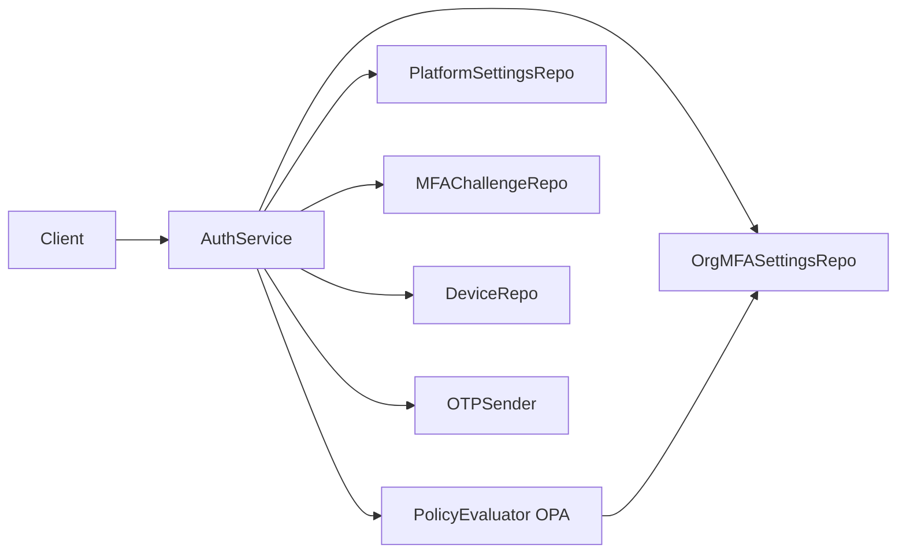
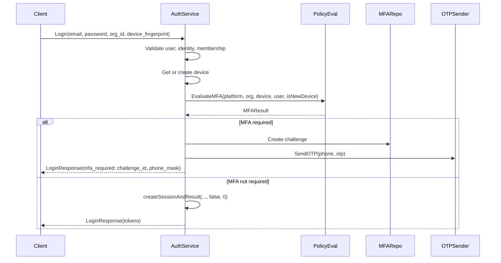
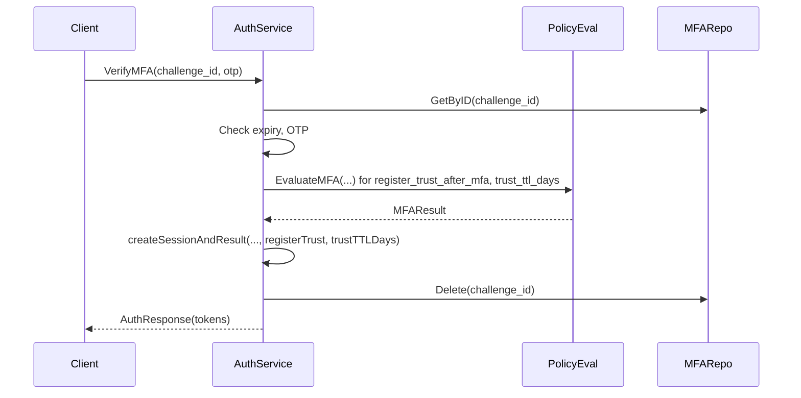

# MFA (Multi-Factor Authentication)

This document describes the risk-based MFA logic in the zero-trust control plane backend: when MFA is required, MFA challenge and OTP flow, API surface, and configuration. Device trust (identifiable, revocable, time-bound) influences whether MFA is required; see [device-trust.md](./device-trust). The canonical proto for auth is [proto/auth/auth.proto](../../../backend/proto/auth/auth.proto); business logic lives in [internal/identity/service/auth_service.go](../../../backend/internal/identity/service/auth_service.go).

**Audience**: Developers integrating with or extending MFA flows, challenge/OTP, or SMS delivery.

## Overview

**Risk-based MFA**: After primary authentication (email/password) and org membership check, the backend evaluates platform- and org-level policy to decide whether to require a second factor before issuing a session. MFA is required when:

- The platform mandates MFA always, or
- The device is new (first time seen for this user/org/fingerprint) and the org requires MFA for new devices, or
- The device is not effectively trusted (e.g. revoked, trust expired, or never trusted) and the org requires MFA for untrusted devices.

**Refresh** can also require MFA when the client sends a **device_fingerprint** with the refresh request: the backend evaluates device-trust policy for that device; if MFA is required (e.g. new or untrusted device), it revokes the current session and returns **RefreshResponse** with **mfa_required** or **phone_required**. The client then completes MFA the same way as after Login (VerifyMFA or SubmitPhoneAndRequestMFA then VerifyMFA).

If MFA is required and the user has a phone on file, the backend creates an MFA challenge, sends a one-time password (OTP) via SMS (PoC: SMS Local), and returns a `challenge_id` and masked phone; the client then calls **VerifyMFA** with the challenge id and OTP to complete login. If MFA is required but the user has no phone, the backend returns **phone_required** with an `intent_id`; the client prompts for phone, calls **SubmitPhoneAndRequestMFA**(intent_id, phone) to create the challenge and send OTP, then calls **VerifyMFA**. After successful VerifyMFA, the user's phone is set and locked (phone_verified = true); one phone per user, immutable after verification. For how device trust and policy evaluation work, see [device-trust.md](./device-trust).

---

## Architecture

---

## Flows

### Login (with optional MFA branch)

1. Validate email, password, org_id; load user and local identity; compare password (constant-time).
2. Validate org membership; return PermissionDenied if not a member.
3. Get or create device by user/org/fingerprint (default fingerprint `"password-login"` if not provided). If the device did not exist, it is treated as **new**.
4. Load platform MFA/device-trust settings (from `platform_settings` or defaults) and org MFA settings (from `org_mfa_settings`).
5. Run policy evaluation: `PolicyEvaluator.EvaluateMFA(ctx, platformSettings, orgSettings, device, user, isNewDevice)` → `MFAResult` (MFARequired, RegisterTrustAfterMFA, TrustTTLDays).
6. **If MFA required**:
   - If user has no phone: create MFA intent (id, user_id, org_id, device_id, expires_at), persist to `mfa_intents`; return `LoginResponse` with `phone_required` (intent_id). Client collects phone and calls SubmitPhoneAndRequestMFA (see below).
   - If user has phone: generate 6-digit OTP, create MFA challenge (id, user_id, org_id, device_id, phone, code_hash, expires_at), persist to `mfa_challenges`; send OTP via SMS if configured; return `LoginResponse` with `mfa_required` (challenge_id, phone_mask).
7. **If MFA not required**:
   - Create session and issue access/refresh tokens; return `LoginResponse` with `tokens`. Device trust is not updated on this path (trust is only set after successful MFA when policy says so).

See [auth_service.go](../../../backend/internal/identity/service/auth_service.go) `Login` and `createSessionAndResult`.

### SubmitPhoneAndRequestMFA (when Login returned phone_required)

1. Validate `intent_id` and `phone` (non-empty); validate phone format (e.g. 10–15 digits, optional leading +).
2. Load MFA intent by id; return Unauthenticated if not found or expired. Delete (consume) the intent so it cannot be reused.
3. Optionally check that the user for this intent does not already have a verified phone (defensive).
4. Generate 6-digit OTP, create MFA challenge with intent's user_id, org_id, device_id and the submitted phone; persist to `mfa_challenges`; send OTP via SMS if configured.
5. Return `challenge_id` and `phone_mask`. Client then calls VerifyMFA with challenge_id and user-entered OTP.

### VerifyMFA

1. Validate `challenge_id` and `otp` (non-empty).
2. Load MFA challenge by id; return Unauthenticated if not found.
3. Check challenge not expired (`expires_at > now`); return FailedPrecondition if expired.
4. Verify OTP with constant-time comparison against stored `code_hash`; return Unauthenticated if mismatch.
5. If user has no phone (first-time), call UserRepo.SetPhoneVerified(userID, challenge.Phone) so the user's phone is set and locked (phone_verified = true); one phone per user, immutable after verification.
6. Re-evaluate policy (same inputs as at Login, but device/user from challenge) to obtain `RegisterTrustAfterMFA` and `TrustTTLDays`.
7. Create session and issue tokens. If policy says register trust, call `UpdateTrustedWithExpiry(deviceID, true, trustedUntil)` with `trustedUntil = now + trustTTLDays`.
8. Delete the MFA challenge; return `AuthResponse` with tokens.

See [auth_service.go](../../../backend/internal/identity/service/auth_service.go) `VerifyMFA`.

---

## Policy evaluation

Whether MFA is required is determined by the **PolicyEvaluator** (interface and OPA implementation). The result includes `MFARequired`, `RegisterTrustAfterMFA`, and `TrustTTLDays`. For the full policy interface, OPA/Rego details, input/output shape, and settings sources, see [device-trust.md](device-trust.md#policy-evaluation).

---

## MFA challenge and OTP

### Challenge

[internal/mfa/domain/challenge.go](../../../backend/internal/mfa/domain/challenge.go): id, user_id, org_id, device_id, phone, code_hash, expires_at, created_at. Stored in **mfa_challenges**. TTL is configured in code (e.g. 10 minutes) when creating the auth service; challenges are deleted after successful VerifyMFA or left to expire.

### OTP

[internal/mfa/otp.go](../../../backend/internal/mfa/otp.go):

- **GenerateOTP()**: returns a 6-digit numeric string (crypto/rand).
- **HashOTP(otp)**: SHA-256 hash, hex-encoded; stored in the challenge as `code_hash`.
- **OTPEqual(providedOTP, storedHash)**: constant-time comparison of the hash of the provided OTP with the stored hash.

### SMS (PoC)

[internal/mfa/sms/smslocal.go](../../../backend/internal/mfa/sms/smslocal.go): client for SMS Local API. Configured via `SMSLocalAPIKey`, `SMSLocalBaseURL`, `SMSLocalSender` ([internal/config/config.go](../../../backend/internal/config/config.go)). If no API key is set, the auth service still creates the challenge but does not send SMS (suitable for tests or when using another channel).

### Dev-only OTP endpoint (PoC)

When **OTP_RETURN_TO_CLIENT** is true and **APP_ENV** is not `"production"` ([internal/config/config.go](../../../backend/internal/config/config.go)), the backend does **not** call the SMS sender. Instead, it stores the plain OTP in an in-memory dev store keyed by `challenge_id`. The client (or BFF) can retrieve the OTP via a **dev-only** endpoint:

- **GET /api/dev/mfa/otp?challenge_id=...** (BFF) → `{ otp: "123456", note: "DEV MODE ONLY" }`. Returns 404 when `NEXT_PUBLIC_DEV_OTP_ENABLED` is not set. The BFF calls the backend gRPC **DevService.GetOTP** ([proto/dev/dev.proto](../../../backend/proto/dev/dev.proto)), which is only registered when dev OTP is enabled and not production. **Guards**: separate module ([internal/devotp](../../../backend/internal/devotp)), feature-flag + env check at startup (config load fails if `OTPReturnToClient && Env == "production"`). Login and SubmitPhoneAndRequestMFA do **not** return OTP in the response; the client fetches OTP from the dev endpoint when in dev mode.

---

## API surface

### LoginResponse

Login returns **LoginResponse** ([proto/auth/auth.proto](../../../backend/proto/auth/auth.proto)) with a oneof:

- **tokens**: AuthResponse (access_token, refresh_token, expires_at, user_id, org_id) when MFA was not required or already satisfied.
- **mfa_required**: MFARequired with `challenge_id` (opaque id for VerifyMFA) and `phone_mask` (e.g. `****1234` for display). OTP is not returned here; when dev OTP is enabled, the client fetches it from GET /api/dev/mfa/otp.
- **phone_required**: PhoneRequired with `intent_id` (one-time; pass to SubmitPhoneAndRequestMFA with user-entered phone). Used when MFA is required but the user has no phone on file.

### RefreshResponse

Refresh returns **RefreshResponse** ([proto/auth/auth.proto](../../../backend/proto/auth/auth.proto)) with the same oneof shape as LoginResponse (tokens | mfa_required | phone_required). When the client sends **RefreshRequest** with optional **device_fingerprint**, the backend evaluates device-trust policy; if MFA is required, it revokes the current session and returns **mfa_required** or **phone_required** instead of new tokens. Challenges and intents created from Refresh are consumed the same way (VerifyMFA, SubmitPhoneAndRequestMFA).

### SubmitPhoneAndRequestMFA

- **RPC**: `SubmitPhoneAndRequestMFA(SubmitPhoneAndRequestMFARequest) returns (SubmitPhoneAndRequestMFAResponse)`.
- **Request**: `intent_id` (from Login's phone_required), `phone` (user-entered; 10–15 digits, optional leading +).
- **Response**: `challenge_id`, `phone_mask`. Client then calls VerifyMFA with challenge_id and OTP (OTP may be fetched from GET /api/dev/mfa/otp when dev OTP is enabled).
- **Public**: No Bearer token required.

### VerifyMFA

- **RPC**: `VerifyMFA(VerifyMFARequest) returns (AuthResponse)`.
- **Request**: `challenge_id` (from Login's mfa_required), `otp` (user-entered code).
- **Response**: Same AuthResponse as Login/Refresh (tokens and user/org ids).
- **Public**: No Bearer token required; method name is in `publicMethods` in [cmd/server/main.go](../../../backend/cmd/server/main.go).

### Errors (MFA)

| Service error | gRPC code | Message |
|---------------|-----------|---------|
| ErrPhoneRequiredForMFA | FailedPrecondition | phone number required for MFA; add in profile |
| ErrInvalidMFAChallenge | Unauthenticated | invalid or expired MFA challenge |
| ErrInvalidOTP | Unauthenticated | invalid or expired MFA challenge |
| ErrInvalidMFAIntent | Unauthenticated | invalid or expired MFA intent |
| ErrChallengeExpired | FailedPrecondition | MFA challenge expired |

Mapping is in [internal/identity/handler/grpc.go](../../../backend/internal/identity/handler/grpc.go) `authErr`.

---

## Configuration

| Variable | Description | Default |
|----------|-------------|---------|
| SMS_LOCAL_API_KEY | API key for SMS Local (PoC). Empty = no SMS sent; challenge still created. | (none) |
| SMS_LOCAL_SENDER | Optional sender ID for SMS Local. | (none) |
| SMS_LOCAL_BASE_URL | SMS Local API base URL. | https://app.smslocal.in/api/smsapi |
| APP_ENV | Application environment (e.g. `development`, `production`). Must not be `production` when OTP_RETURN_TO_CLIENT is true. | (none) |
| OTP_RETURN_TO_CLIENT | When true (and APP_ENV != production), dev OTP mode: SMS not sent; OTP stored for GET /api/dev/mfa/otp. For PoC without DLT. | false |

MFA challenge TTL (e.g. 10 minutes) is set in code when constructing the auth service ([cmd/server/main.go](../../../backend/cmd/server/main.go)).

For platform and org MFA/device-trust settings (e.g. default trust TTL), see [device-trust.md](device-trust.md#configuration). Schema for `mfa_challenges` and related tables: [database.md](./database).

---

## Testing

Auth service tests ([internal/identity/service/auth_service_test.go](../../../backend/internal/identity/service/auth_service_test.go)) use a mock **PolicyEvaluator** and in-memory repos. The MFA branch (Login returning mfa_required) and VerifyMFA can be tested without a real SMS sender; the mock evaluator can be configured to require or skip MFA based on device and org settings.

---

## See also

- [auth.md](./auth) — Authentication overview, Register, Login, Refresh, Logout, and public methods.
- [database.md](./database) — Schema for mfa_challenges and device/user columns used by MFA.
- [device-trust.md](./device-trust) — Device trust model, policy evaluation (OPA/Rego), trust registration and revocation.
