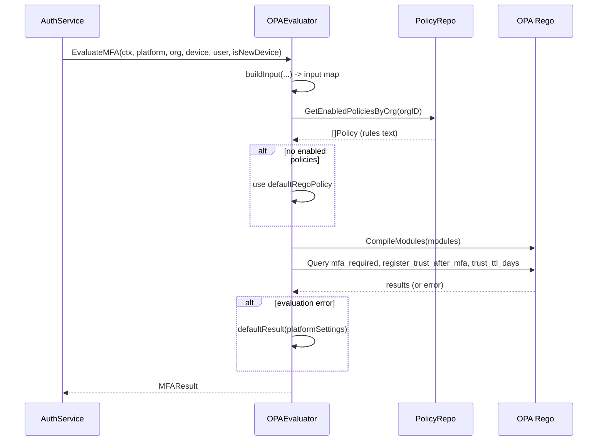

# Policy Engine (OPA/Rego)

This document describes the **policy engine** in the zero-trust control plane backend: OPA/Rego integration, policy structure (database, domain, API, Rego contract), default policy, and the full evaluation flow. The policy engine is used only for **device-trust / MFA decisions** (when to require MFA, whether to register trust after MFA, and trust TTL in days). For device-trust semantics and MFA flows, see [device-trust.md](./device-trust) and [mfa.md](./mfa).

**Audience**: Developers writing or debugging Rego policies, or extending the evaluator.

## Overview

- **Role**: The policy engine decides **MFA required**, **register trust after MFA**, and **trust TTL (days)** for device-trust. It is used by auth flows (Login, Refresh, VerifyMFA) only; there is no other policy enforcement in this codebase.
- **Implementation**: **In-process OPA** via the Go library [open-policy-agent/opa v1](https://pkg.go.dev/github.com/open-policy-agent/opa/v1) (version in [go.mod](../../../backend/go.mod)). Rego modules are compiled and evaluated per request; there is no separate OPA server.
- **Entry point**: The [PolicyEvaluator.EvaluateMFA](../../../backend/internal/policy/engine/evaluator.go) interface; default implementation [OPAEvaluator](../../../backend/internal/policy/engine/opa_evaluator.go). Wired in [cmd/server/main.go](../../../backend/cmd/server/main.go) and passed into the auth service.

## OPA/Rego integration

- **Libraries**: `github.com/open-policy-agent/opa/v1/ast` (parse/compile modules), `github.com/open-policy-agent/opa/v1/rego` (query and eval). Version is taken from [go.mod](../../../backend/go.mod) (e.g. v1.13.1).
- **Compilation**: `ast.CompileModules(modules)` where `modules` is a map of filename → Rego source string. All enabled org policies are loaded and compiled together as `policy_0.rego`, `policy_1.rego`, … in the same package.
- **Evaluation**: For each request, the engine builds an `input` map (see [Policy structure / Rego contract](#rego-contract) below), then runs three Rego queries: `data.ztcp.device_trust.mfa_required`, `data.ztcp.device_trust.register_trust_after_mfa`, `data.ztcp.device_trust.trust_ttl_days` via `rego.New(..., rego.Query(...), rego.Compiler(compiler), rego.Input(input))` and `Eval(ctx)`.
- **Package contract**: Rego code **must** use package `ztcp.device_trust` and define (at least) the three rules above; otherwise the engine falls back to the default policy and safe defaults (see [Evaluation flow](#evaluation-flow)).
- **Validation on write**: CreatePolicy and UpdatePolicy validate Rego syntax with `ast.ParseModule("", rules)` in [handler/grpc.go](../../../backend/internal/policy/handler/grpc.go) (`validateRego`). There is no runtime validation of package or rule names at write time; invalid or missing rules at eval time trigger the fallback.

## Policy structure

### Database

Table **policies** in [internal/db/sqlc/schema/001_schema.sql](../../../backend/internal/db/sqlc/schema/001_schema.sql):

| Column | Type | Constraints |
|--------|------|-------------|
| `id` | VARCHAR | PRIMARY KEY |
| `org_id` | VARCHAR | NOT NULL, REFERENCES organizations(id) |
| `rules` | TEXT | NOT NULL (Rego source) |
| `enabled` | BOOLEAN | NOT NULL |
| `created_at` | TIMESTAMPTZ | NOT NULL |

One policy = one row; an org can have multiple enabled policies. The evaluator loads only rows where `enabled = true`, ordered by `created_at`.

### Domain and API

- **Domain**: [internal/policy/domain/policy.go](../../../backend/internal/policy/domain/policy.go) — `Policy` struct with ID, OrgID, Rules, Enabled, CreatedAt.
- **API**: [proto/policy/policy.proto](../../../backend/proto/policy/policy.proto) — **PolicyService**: CreatePolicy, UpdatePolicy, DeletePolicy, ListPolicies. The `rules` field is the Rego source text.

### Rego contract

#### Input

The engine passes a single JSON object to OPA as `input`. It has four top-level keys: `platform`, `org`, `device`, `user`. Types: booleans, strings, numbers; timestamps are RFC3339 strings.

| Path | Type | Description |
|------|------|-------------|
| `platform.mfa_required_always` | bool | Platform-wide: always require MFA |
| `platform.default_trust_ttl_days` | int | Default trust TTL when org does not set one |
| `org.mfa_required_for_new_device` | bool | Require MFA when device is new |
| `org.mfa_required_for_untrusted` | bool | Require MFA when device is not effectively trusted |
| `org.mfa_required_always` | bool | Org-wide: always require MFA |
| `org.register_trust_after_mfa` | bool | After successful MFA, register device as trusted |
| `org.trust_ttl_days` | int | Trust TTL in days (used for `trusted_until`) |
| `device.id` | string | Device ID |
| `device.trusted` | bool | Device marked trusted |
| `device.trusted_until` | string or null | RFC3339; trust expiry |
| `device.revoked_at` | string or null | RFC3339; if set, device revoked |
| `device.is_new` | bool | First time this device (user/org/fingerprint) is seen |
| `device.is_effectively_trusted` | bool | Trusted and not revoked and not expired |
| `user.id` | string | User ID |
| `user.has_phone` | bool | User has a phone on file (for MFA) |

#### Output

Rules in package `ztcp.device_trust` that the engine queries:

| Rule | Type | Meaning |
|------|------|---------|
| `mfa_required` | bool | Whether to require MFA before issuing a session. When true, Login/Refresh return mfa_required or phone_required. |
| `register_trust_after_mfa` | bool | Whether to mark the device trusted after successful VerifyMFA. |
| `trust_ttl_days` | number | Device trust TTL in days; used to set `trusted_until` when registering trust after MFA. |

### Default policy

When an org has no enabled policies, or evaluation fails, the engine uses the embedded default Rego policy in [opa_evaluator.go](../../../backend/internal/policy/engine/opa_evaluator.go) (`defaultRegoPolicy`). Full text:

```rego
package ztcp.device_trust

default mfa_required = false
default register_trust_after_mfa = true
default trust_ttl_days = 30

mfa_required if {
	input.platform.mfa_required_always
}

mfa_required if {
	input.device.is_new
	input.org.mfa_required_for_new_device
}

mfa_required if {
	not input.device.is_effectively_trusted
	input.org.mfa_required_for_untrusted
}

register_trust_after_mfa = input.org.register_trust_after_mfa if {
	input.org.register_trust_after_mfa != null
}
register_trust_after_mfa = true if {
	not input.org.register_trust_after_mfa
}

trust_ttl_days = input.org.trust_ttl_days if {
	input.org.trust_ttl_days > 0
}
trust_ttl_days = input.platform.default_trust_ttl_days if {
	input.org.trust_ttl_days <= 0
	input.platform.default_trust_ttl_days > 0
}
```

**Explanation**:

- **mfa_required**: True if (1) platform mandates MFA always, or (2) device is new and org requires MFA for new devices, or (3) device is not effectively trusted and org requires MFA for untrusted devices.
- **register_trust_after_mfa**: From org setting; default true.
- **trust_ttl_days**: From org if &gt; 0; otherwise from platform default.

## Evaluation flow



**Steps in prose**:

1. The auth service (Login, Refresh, or VerifyMFA) loads platform settings, org MFA settings, device, user, and whether the device is new; then calls `policyEvaluator.EvaluateMFA(ctx, ...)`.
2. **OPAEvaluator** builds `input` from those arguments via [buildInput](../../../backend/internal/policy/engine/opa_evaluator.go); loads enabled policies for the org via `GetEnabledPoliciesByOrg`; if none, uses `defaultRegoPolicy`.
3. It compiles all Rego modules (one per enabled policy, or the single default); runs the three queries with that `input`.
4. It builds **MFAResult** from the query results (with type coercion for `trust_ttl_days` — number, float, or int). On compile or eval error, it returns `defaultResult(platformSettings)`: MFARequired false, RegisterTrustAfterMFA true, TrustTTLDays from platform or 30.
5. The auth service uses MFAResult to decide whether to require MFA (return mfa_required or phone_required) and, after VerifyMFA, whether to register trust and with which TTL.

## Multiple policies per org

All **enabled** policies for the org are loaded (order: by `created_at`). Each policy’s `rules` string is compiled as a separate module (`policy_0.rego`, `policy_1.rego`, …) in the same package `ztcp.device_trust`. OPA merges rules from multiple modules in the same package; for example, multiple `mfa_required` rules act as alternatives (if any rule body succeeds, `mfa_required` can be true). Custom policies must use package `ztcp.device_trust` and conform to the input/output contract so they compose predictably.

## Health check

[HealthService.HealthCheck](../../../backend/internal/health/handler/grpc.go) optionally runs a **PolicyChecker**. When auth is enabled, the server sets `HealthPolicyChecker = OPAEvaluator` in [main.go](../../../backend/cmd/server/main.go). OPAEvaluator’s [HealthCheck](../../../backend/internal/policy/engine/opa_evaluator.go) compiles the default Rego policy and runs one query with minimal input (no database). If that fails, readiness returns NOT_SERVING. This verifies the in-process OPA engine works.

## See also

- [device-trust.md](./device-trust) — Device trust semantics, when MFA is required, registration after MFA.
- [mfa.md](./mfa) — Login/Refresh/VerifyMFA flows and how they use MFAResult.
- [database.md](./database) — `policies` table and schema.
