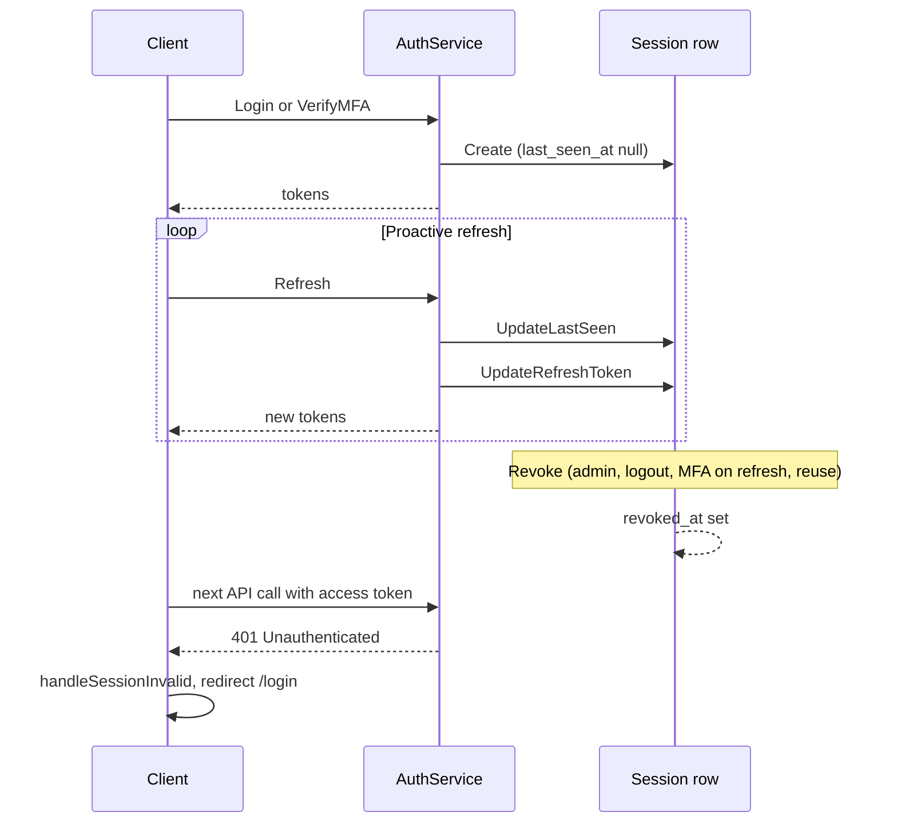

# Session Lifecycle

This document describes the **session lifecycle** in the zero-trust control plane: when and how sessions are created, how heartbeats (last_seen_at) work, how sessions end (revocation), and how clients behave (proactive refresh, 401 handling, logout). For SessionService RPCs and token invalidation details, see [sessions.md](./sessions).

**Audience**: Developers integrating clients or operators reasoning about session state, last_seen, and revocation.

## Overview

Sessions are created on **Login** (when MFA is not required) or after **VerifyMFA**. They are kept alive by **Refresh**, which also updates `last_seen_at`. Sessions end by **revocation**: explicit revoke (org admin), **Logout**, Refresh returning MFA required (current session revoked first), or refresh-token reuse (all user sessions revoked). Clients proactively refresh before access token expiry and treat **401** as session invalid (clear storage, redirect to login). For SessionService APIs and token invalidation (SessionValidator, Refresh rejection), see [sessions.md](./sessions).

## Session creation

### When

1. **Login** — When MFA is not required, [AuthService.Login](../../../backend/internal/identity/service/auth_service.go) calls `createSessionAndResult` and returns tokens. No session is created when Login returns **mfa_required** or **phone_required** until the user completes MFA (VerifyMFA or SubmitPhoneAndRequestMFA then VerifyMFA).
2. **VerifyMFA** — After successful OTP verification, [AuthService.VerifyMFA](../../../backend/internal/identity/service/auth_service.go) calls `createSessionAndResult` and returns tokens; the device may be marked trusted if policy says so.

### What

[createSessionAndResult](../../../backend/internal/identity/service/auth_service.go) does the following:

- Generates a session ID (UUID).
- Sets **expires_at** = now + refresh TTL (from config `JWT_REFRESH_TTL`, default 168h).
- Issues the first refresh and access JWTs; stores refresh JTI and hashed refresh token on the session.
- Persists the session via [SessionRepo.Create](../../../backend/internal/session/repository/postgres.go).

The session row contains: **id**, **user_id**, **org_id**, **device_id**, **expires_at**, **revoked_at** (null), **last_seen_at** (null at creation), **refresh_jti**, **refresh_token_hash**, **created_at**. After VerifyMFA, if policy returns register trust, the device is marked trusted with the policy’s trust TTL.

### Domain and database

- **Domain**: [internal/session/domain/session.go](../../../backend/internal/session/domain/session.go) — `Session` struct.
- **Database**: The **sessions** table is described in [database.md](./database).

## Heartbeats and last_seen_at

There is **no dedicated heartbeat RPC**. The only server-side update that touches liveness is **Refresh**. On each successful Refresh, the auth service calls [SessionRepo.UpdateLastSeen](../../../backend/internal/session/repository/postgres.go) with the current time before rotating tokens ([auth_service.go](../../../backend/internal/identity/service/auth_service.go) around line 772). So **last_seen_at** is updated whenever the client refreshes; it is **not** updated on every protected API call.

### Session expiry

The session row has **expires_at** set at creation (creation time + refresh TTL). Refresh does **not** check or update this field. Validity is determined by (1) session not revoked and (2) refresh JWT valid (signature and `exp`). On each Refresh, new tokens are issued (refresh token gets a new `exp`), so the effective session can extend as long as the client keeps refreshing. The DB **expires_at** is effectively “creation + initial TTL” and can be used for visibility or cleanup; it is not currently enforced on Refresh.

### Idle timeout

Org policy config has an **idle_timeout** field for future use. The backend does **not** currently revoke sessions based on idle time or `last_seen_at`. **last_seen_at** is for observability and admin visibility (e.g. “last activity” in session lists).

## Revocation (summary)

Sessions end in these ways:

1. **Explicit revoke** — SessionService.RevokeSession or RevokeAllSessionsForUser (org admin).
2. **Logout** — AuthService.Logout (by refresh token or Bearer context).
3. **Refresh returns MFA required** — The current session is revoked before returning mfa_required or phone_required.
4. **Refresh token reuse** — If an old refresh token is used after rotation, all sessions for that user are revoked and ErrRefreshTokenReuse is returned.

**Effect**: Revocation sets `sessions.revoked_at`. Refresh then returns ErrInvalidRefreshToken for that session; the auth interceptor’s SessionValidator rejects access tokens for that session (Unauthenticated → 401). Full detail: [sessions.md — Token invalidation](./sessions#token-invalidation).

## Client behavior

### Storage

The web client ([frontend/contexts/auth-context.tsx](../../../frontend/contexts/auth-context.tsx)) stores **access_token**, **refresh_token**, **expires_at** (access token expiry), **user_id**, and **org_id** in localStorage.

### Proactive refresh

The auth context runs a timer so that **refresh()** is called **before** the access token expires (e.g. 5 minutes before `expiresAt`). refresh() calls the auth API with refresh_token and optional device_fingerprint; on success it updates stored tokens and expires_at; on failure (e.g. 401 or InvalidRefreshToken) it clears storage and sets state to null.

### MFA on refresh

If the backend returns **mfa_required** or **phone_required**, the client clears storage, stores the challenge or intent ID in sessionStorage, and redirects to /login to complete MFA.

### 401 on API calls

Dashboard and other authenticated pages use **handleSessionInvalid()** when any fetch returns 401: clear storage, redirect to /login. So a revoked session leads to 401 on the next API call and immediate redirect.

### Logout

The client calls the logout API with access and refresh token, then clears local state regardless of API success.

## See also

- [sessions.md](./sessions) — SessionService RPCs, revocation semantics, token invalidation (SessionValidator, Refresh).
- [auth.md](./auth) — Login, Refresh, Logout, tokens, interceptor.
