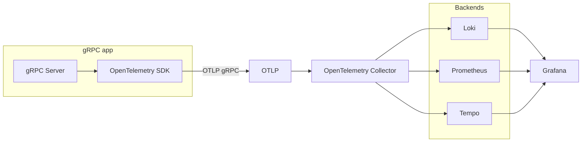
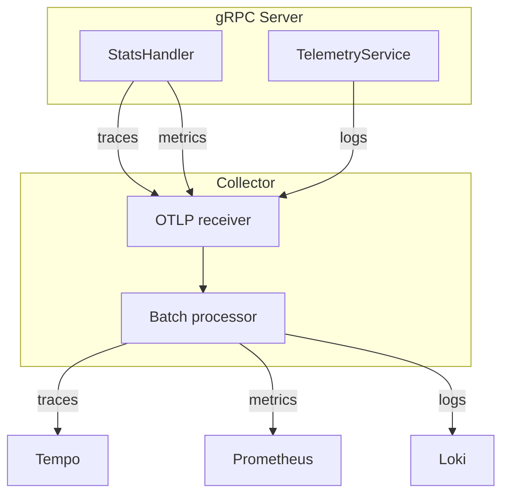
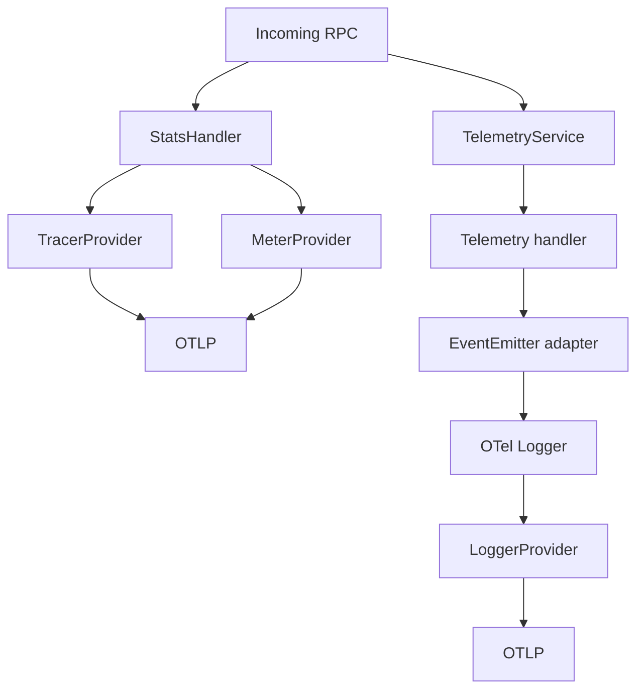
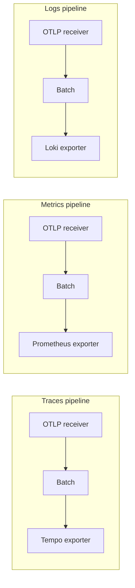
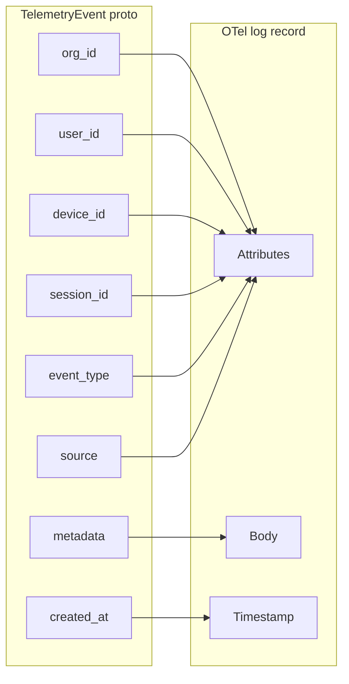

# Telemetry

The telemetry system provides observability for the gRPC API and custom application events: **traces** for request flow and latency, **metrics** for rates and duration, and **logs** for explicit events emitted via the TelemetryService. All signals are produced by the gRPC server using the OpenTelemetry SDK, exported over **OTLP** to an **OpenTelemetry Collector**, which fans out to **Loki** (logs), **Prometheus** (metrics), and **Tempo** (traces) for querying and dashboards in **Grafana**.

## End-to-end architecture

The server emits **traces** (spans per RPC), **metrics** (request count and duration), and **logs** (custom events from TelemetryService). All three are sent over a single OTLP connection to the Collector, which batches and routes them to the appropriate backends. Grafana queries Loki, Prometheus, and Tempo as datasources to build dashboards and explore traces.

## Signal flow (traces, metrics, logs)

- **Traces**: Produced by the OTel gRPC **StatsHandler** for every RPC (except those on the skip list). Each RPC becomes a span with method name, gRPC status code, and duration. The TracerProvider exports spans via OTLP to the Collector, which forwards them to **Tempo**. Use Tempo to inspect request flow and latency.

- **Metrics**: Produced by the same **StatsHandler**; the MeterProvider records gRPC request count, duration, and status. Metrics are exported via OTLP to the Collector and then to **Prometheus** (the reference config exposes a scrape endpoint). Use Prometheus (and PromQL) for rate and latency panels.

- **Logs**: Produced only by **TelemetryService** when clients call `EmitTelemetryEvent` or `BatchEmitTelemetry`. The handler converts each request to a `TelemetryEvent` and passes it to the EventEmitter; the OTel adapter builds an OTel log record and emits it via the LoggerProvider. Logs are exported via OTLP to the Collector and then to **Loki**. Use LogQL to query by org, event type, or source.

The providers (TracerProvider, MeterProvider, LoggerProvider) are created at startup in [internal/telemetry/otel/setup.go](../../../backend/internal/telemetry/otel/setup.go) and wired in [cmd/server/main.go](../../../backend/cmd/server/main.go).

## gRPC server telemetry

**OTel providers**

At startup, the server calls `otel.NewProviders()` with `OTEL_EXPORTER_OTLP_ENDPOINT` and `OTEL_SERVICE_NAME`. Providers are created in [internal/telemetry/otel/setup.go](../../../backend/internal/telemetry/otel/setup.go): a **TracerProvider** (with OTLP trace exporter and batch span processor), a **MeterProvider** (with OTLP metric exporter and a periodic reader), and a **LoggerProvider** (with OTLP log exporter and batch processor). When the endpoint is empty, no-op providers are returned so the server runs without a Collector. `SetGlobal()` is called so the tracer and meter are used by instrumentation (e.g. the gRPC StatsHandler).

**StatsHandler**

The gRPC server is created with `grpc.StatsHandler(otelgrpc.NewServerHandler(...))`, passing `WithTracerProvider`, `WithMeterProvider`, and `WithFilter`. The handler creates a **span** and **metrics** for each RPC (method, status, duration). The filter excludes `HealthService/HealthCheck` and, when dev OTP is enabled, `DevService/GetOTP`, so those calls do not create spans or metrics.

**TelemetryService**

[internal/telemetry/handler/grpc.go](../../../backend/internal/telemetry/handler/grpc.go) implements `EmitTelemetryEvent` and `BatchEmitTelemetry`. Each request is converted to a `TelemetryEvent` (with `CreatedAt` set server-side) and passed to the **EventEmitter** dependency. The emitter is implemented in [internal/telemetry/otel/adapter.go](../../../backend/internal/telemetry/otel/adapter.go): it builds an OTel log record (attributes from the event fields, body from `metadata` bytes) and calls `Logger.Emit()`. Emission is best-effort; the RPC always returns success and any emit failure is only logged.

## OpenTelemetry Collector

The reference configuration is in [deploy/otelcol-config.yaml](../../../deploy/otelcol-config.yaml). The Collector runs three pipelines in parallel:

- **Receivers**: A single **OTLP** receiver accepts gRPC on port **4317** and HTTP on **4318**. The gRPC server is configured to send to the gRPC endpoint (e.g. `http://localhost:4317`).

- **Processors**: A **batch** processor is used in each pipeline (configurable `send_batch_size` and `timeout`) to reduce export overhead.

- **Exporters**:
  - **Traces** → **OTLP** exporter pointing at Tempo (e.g. `tempo:4317`). Tempo receives OTLP trace data.
  - **Metrics** → **Prometheus** exporter that exposes a scrape endpoint (e.g. on port 8889 with namespace `ztcp`). Prometheus scrapes this endpoint.
  - **Logs** → **Loki** exporter that pushes to Loki’s HTTP push API. The Loki exporter is part of the **contrib** distribution; use `otelcol-contrib` when running the Collector.

## Event model

The [telemetry.proto](../../../backend/proto/telemetry/telemetry.proto) message **TelemetryEvent** has: `org_id`, `user_id`, `device_id`, `session_id`, `event_type`, `source`, `metadata` (bytes, typically JSON), and `created_at` (timestamp). When TelemetryService emits an event, the adapter maps these to an OTel log record: each of the identity and classification fields becomes a **log attribute**, `metadata` becomes the log **body**, and `created_at` becomes the log **timestamp** (or the current time if unset). This keeps querying in Loki simple by org, event type, and source.

## When telemetry is enabled or disabled

- **Server**: Telemetry is **enabled** when `OTEL_EXPORTER_OTLP_ENDPOINT` is non-empty and the OTLP exporters are created successfully. In that case, the server sends traces, metrics, and logs to the configured endpoint. When the endpoint is **empty**, `NewProviders()` returns no-op providers (no exporters); the server runs normally but does not send any telemetry. You can run the server without a Collector for local or test environments.

- **Individual signals**: Standard OpenTelemetry environment variables (e.g. `OTEL_TRACES_EXPORTER=none`, `OTEL_METRICS_EXPORTER=none`, `OTEL_LOGS_EXPORTER=none`) can be used to disable specific signals if your deployment or SDK supports them.

## Configuration

| Variable | Used by | Description |
|----------|---------|-------------|
| `OTEL_EXPORTER_OTLP_ENDPOINT` | server | OTLP gRPC endpoint (e.g. `http://localhost:4317` or `localhost:4317`). When set, the server exports traces, metrics, and logs. |
| `OTEL_SERVICE_NAME` | server | Service name for resource attributes (default `ztcp-grpc`). |
| `GRPC_ADDR` | server | gRPC listen address. |

The endpoint can be given as `host:port` or `http://host:port` / `https://host:port`; the scheme is stripped for the gRPC dial. For the full set of options, see [OpenTelemetry environment variables](https://opentelemetry.io/docs/specs/otel/protocol/exporter/).

## Grafana

1. **Datasources**: Add Loki (e.g. `http://loki:3100`), Prometheus (e.g. `http://prometheus:9090`), and Tempo (e.g. `http://tempo:3200` or the OTLP endpoint). Point them at the same instances the Collector exports to.

2. **Example queries**:
   - **Logs (LogQL)**:
     - `{job="ztcp"}` — All log lines from the ztcp service.
     - `{job="ztcp"} | json | org_id="org1"` — Logs for a specific org (after parsing JSON).
     - Filter by `event_type` or `source` in the JSON to narrow to custom event types.
   - **Metrics (PromQL)**: Use the metrics produced by the OTel gRPC instrumentation (scope `go.opentelemetry.io/contrib/instrumentation/google.golang.org/grpc/otelgrpc`) for request count, duration, and status. Example: rate of requests per method over a time window.
   - **Traces**: In Tempo, search by service name `ztcp-grpc` or by operation/method to inspect individual request traces and latency.

## Skip list

The OTel gRPC filter does not create spans or metrics for:

- `HealthService/HealthCheck`
- `DevService/GetOTP` (when dev OTP is enabled)

This avoids flooding traces and metrics with high-volume health checks and dev OTP calls.
